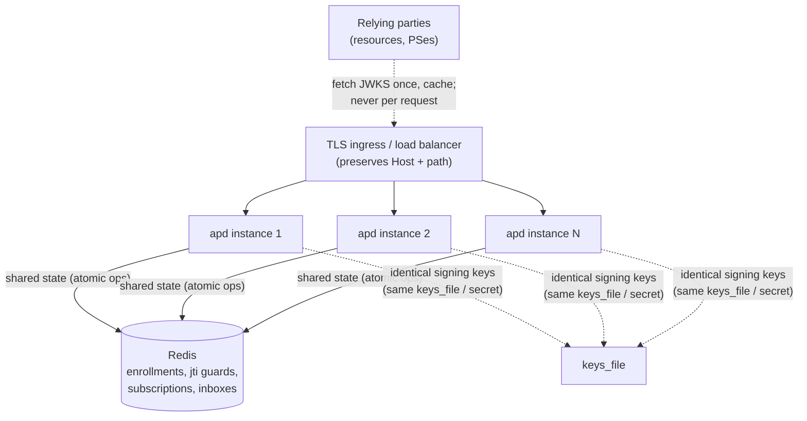

# Deploying apd

`apd` is a single static binary. The two things that make it production-ready
are **TLS** (AAuth requires HTTPS server identifiers) and, for more than one
instance, **shared state + shared signing keys**.

## Trust & TLS

AAuth identities are HTTPS URLs and every token is verified by fetching
`{issuer}/.well-known/aauth-agent.json` → `jwks_uri` over TLS. Therefore:

- `issuer` MUST be the real `https://` origin relying parties will reach.
- `apd` itself speaks plain HTTP; terminate TLS in front of it (reverse proxy,
  load balancer, or service mesh) and forward to `listen`.
- The proxy MUST preserve the `Host` header and the request path/method — the
  HTTP Message Signature covers `@authority` and `@path`, so a proxy that
  rewrites the Host or path will break verification. Do **not** let the proxy
  strip or reorder the `Signature`, `Signature-Input`, or `Signature-Key`
  headers.
- Do not enable `insecure_dev_mode` in production.

Example nginx front:

```nginx
server {
  listen 443 ssl;
  server_name ap.example.com;
  ssl_certificate     /etc/ssl/ap.example.com.crt;
  ssl_certificate_key /etc/ssl/ap.example.com.key;

  location / {
    proxy_pass http://127.0.0.1:8420;
    proxy_set_header Host $host;                 # signature covers @authority
    proxy_set_header X-Forwarded-For $remote_addr;
    proxy_read_timeout 75s;                       # allow /inbox long-poll
  }
}
```

With `issuer = "https://ap.example.com"` and `listen = "127.0.0.1:8420"`.

## Single instance

```json
{
  "issuer": "https://ap.example.com",
  "listen": "127.0.0.1:8420",
  "keys_file": "/var/lib/apd/apd-keys.json",
  "storage": { "backend": "file", "path": "/var/lib/apd/state.json" },
  "enrollment": { "mode": "token" },
  "events": { "enabled": true }
}
```

`file` storage is crash-safe (atomic snapshot per mutation). Put the admin token
in the environment, not the file:

```sh
APD_ADMIN_TOKEN="$(openssl rand -hex 32)" apd serve --config /etc/apd/apd.json
```

## Multi-instance (horizontal scale)

Because verification is stateless, you scale read/verify load simply by adding
instances behind the load balancer — relying parties only ever hit the
well-known + JWKS endpoints, which serve pre-serialized bytes with cache headers.
The instances must share two things:



1. **The same signing keys.** Mount the identical `keys_file` (or the same
   secret) on every instance. A token signed by instance A is verified by anyone
   using the JWKS all instances publish.
2. **Shared state via Redis.** Enrollments, single-use enrollment tokens,
   naming-JWT replay guards, event subscriptions/counters, and inboxes live in
   Redis so any instance can serve any agent. All the mutating operations are
   atomic Redis primitives, so concurrent instances stay correct (single-use
   tokens are consumed exactly once, `max_uses` counts exactly, etc.).

```json
{
  "issuer": "https://ap.example.com",
  "listen": "0.0.0.0:8420",
  "keys_file": "/etc/apd/apd-keys.json",
  "storage": { "backend": "redis", "redis_addr": "redis.internal:6379", "key_prefix": "apd:" },
  "enrollment": { "mode": "token" },
  "events": { "enabled": true }
}
```

Notes:

- The built-in Redis client is plain TCP RESP2. Keep Redis on a private network
  or tunnel it (stunnel / mesh mTLS). Requires Redis ≥ 6.2.
- Clocks must be NTP-synced across instances and agents — the signature
  `created` window (default 60 s) depends on it.
- `/inbox` long-poll holds a connection up to 50 s; size your proxy read timeout
  and per-instance connection limits accordingly, or have agents poll with
  shorter `Prefer: wait`.

## Key management

```sh
apd keygen --keys apd-keys.json                 # create
apd keygen --keys apd-keys.json --rotate        # add a new active key
apd keygen --keys apd-keys.json --prune-days 2  # drop retired keys >2d old
```

Rotation is safe and online: `--rotate` appends a new key, marks it active, and
keeps the previous **public** keys in the JWKS so tokens already signed with them
still verify. Distribute the updated `keys_file` to all instances (rolling
restart, or a shared mount), then, after the longest token lifetime has elapsed
(≤ `agent_token_ttl_secs`), prune the retired keys. The `keys_file` is a secret —
mode `0600` (the tool sets this), backed up, never committed.

Revoking a single agent is `POST /admin/agents/{local}/revoke`: the AP refuses to
issue that agent new tokens; its current token ages out within its (≤1 h)
lifetime. This is the AP's revocation lever — short token lifetimes make every
refusal effective quickly without any cross-party coordination.

## systemd

```ini
[Unit]
Description=apd (AAuth Agent Provider)
After=network-online.target redis.service
Wants=network-online.target

[Service]
ExecStart=/usr/local/bin/apd serve --config /etc/apd/apd.json
Environment=APD_ADMIN_TOKEN=%I
DynamicUser=yes
StateDirectory=apd
AmbientCapabilities=
NoNewPrivileges=yes
ProtectSystem=strict
ProtectHome=yes
Restart=on-failure

[Install]
WantedBy=multi-user.target
```

(Point `keys_file`/`storage.path` at `/var/lib/apd` = the `StateDirectory`.)

## Container

`apd` is a static-ish binary; a distroless or `scratch`+glibc image works. Build
`--release`, copy the binary, ship the config via a mounted file + env secrets,
expose the `listen` port, and terminate TLS at the ingress. Health-check
`GET /healthz`.

## Operational checklist

- [ ] `issuer` is the real HTTPS origin; TLS terminates in front; Host/path preserved.
- [ ] `keys_file` is identical on all instances, `0600`, backed up, not in VCS.
- [ ] `admin_token` and Redis address come from the environment/secret store.
- [ ] Multi-instance ⇒ `redis` backend; Redis is private/tunneled and ≥6.2.
- [ ] NTP on all hosts.
- [ ] `insecure_dev_mode` is **off**.
- [ ] Monitoring hits `/healthz`; alert on non-200.
- [ ] A key-rotation runbook exists (rotate → distribute → wait ≥ token TTL → prune).
