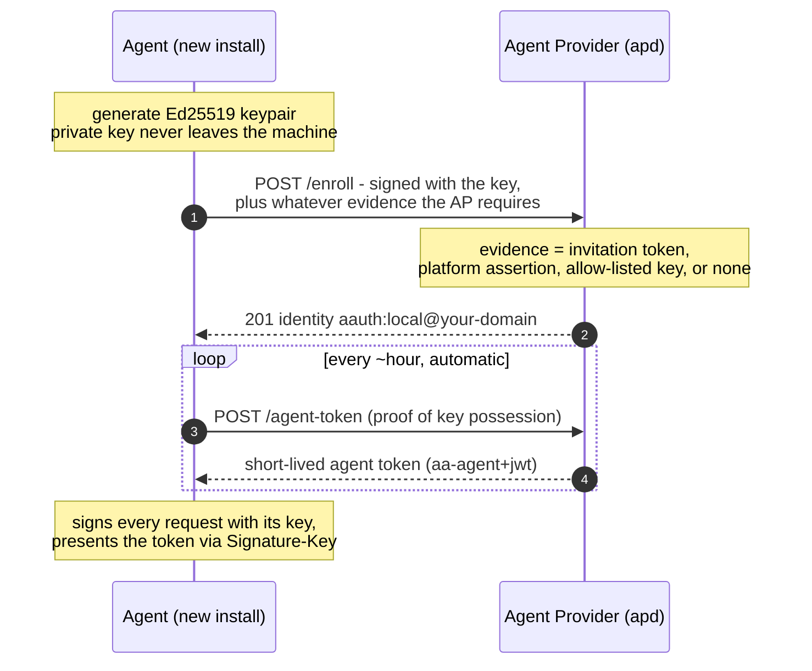
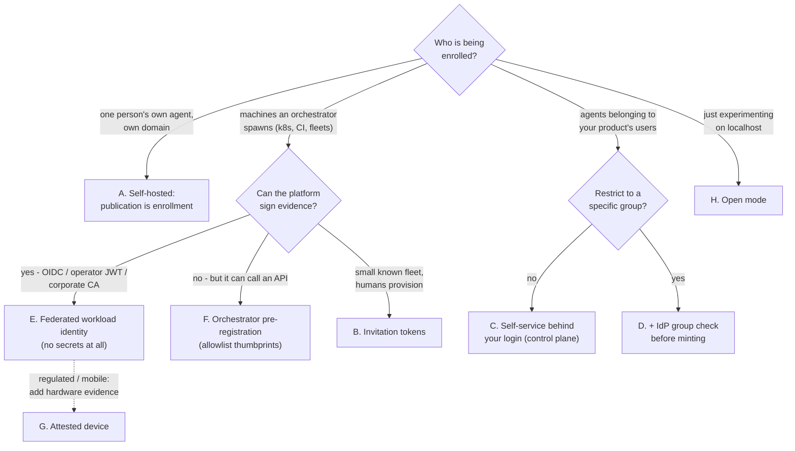
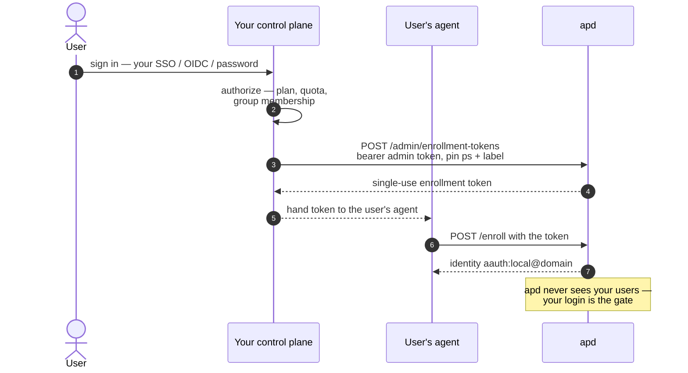

# Enrollment: how agents get an identity, and how to set it up for your users

Enrollment is the one-time step where an agent first obtains its identity from the
Agent Provider. This page explains **what enrollment is**, **how the AAuth spec
frames it**, **what `apd` gives you**, and **the practical ways to connect your
users to it** — from a single trusted machine to a multi-company service.

If you just want to run the ceremony as an agent developer, see
[`guide-ai-agent-auth.md`](guide-ai-agent-auth.md). This page is about the
*setup/operator* side: deciding who may enroll and wiring your users in.

---

## 1. Enrollment in one picture



Enrollment happens **once per install**. After it, the agent just refreshes
short-lived tokens automatically. There is no password and no shared secret at
any step — the credential is a key born on the device.

---

## 2. What the AAuth spec says (and deliberately doesn't)

The AAuth protocol defines the *agent token* and how it's used, but **leaves
enrollment up to the Agent Provider**. The Bootstrap draft is explicit that
enrollment is:

- **AP-internal and platform-specific** — there's no standard enrollment endpoint
  or wire format. Two APs can enroll completely differently and still interoperate,
  because the only thing the rest of the world sees is a valid token.
- **Evidence-based, your choice** — the AP issues an identity after the agent
  "presents whatever evidence the AP requires: a signed-in account, an attested
  device, a published JWKS, etc." *You* decide what that evidence is.
- **NOT the user↔agent binding** — deciding *which person* an agent acts for is
  the Person Server's job, done later. Enrollment produces an *identity*; a Person
  Server attaches *accountability* if/when you use one.

So the spec's answer to "does the AP authenticate the user?" is: **only if you
want it to.** The AP's real job is a policy decision — *"should this agent get a
token from me?"* — and the gate for that decision is yours to define.

The spec sketches two ends of a spectrum, and you pick where you sit:

| Flavor | The gate | User accounts at the AP? |
|---|---|---|
| **User-signed-in** | the user logs into the AP (or the app the AP powers) | yes — the AP maps a user to the agent's key |
| **Per-install / attested / invited** | a device attestation, an invitation token, or nothing | no — "a new device is just a new agent" |

Both are valid AAuth. Consumer web/mobile agents lean toward "user-signed-in";
headless and privacy-preserving deployments lean toward "per-install."

---

## 3. What `apd` gives you

`apd` ships four composable enrollment methods (`enrollment.methods`, any
combination; the legacy `mode` field still works):

- **`token`** (default) — an agent can only enroll if it presents a
  **single-use enrollment token** that an operator minted. Whoever mints the
  token has authorized the enrollment. Mint via the admin API
  (`POST /admin/enrollment-tokens`) or the CLI (`apd enroll-token`); a token may
  pin a `ps`, carry a `label`, and expires. For **local development / CI**, you
  can also predefine reusable **static tokens** in config
  (`enrollment.static_tokens`, or the `APD_STATIC_ENROLL_TOKEN` env var) so
  agents enroll with a known token without a runtime mint step — a dev
  convenience with guardrails (≥16 chars, startup warning, audited), not a
  production pattern.
- **`federated`** — the agent presents a signed **assertion** from a trusted
  issuer instead of a secret: a Kubernetes/cloud/CI OIDC token, an
  operator-minted key-bound JWT, or a JWS backed by a corporate-CA certificate
  chain (`x5c`). **No per-agent secret ever exists.** This is the
  enterprise/dynamic-fleet path — full reference and per-environment recipes in
  [`federated-enrollment.md`](federated-enrollment.md).
- **`allowlist`** — an orchestrator pre-registers the agent's key **thumbprint**
  via the admin API (`POST /admin/allowed-keys`); the agent then enrolls with
  only its key. API-driven delegation without assertion signing.
- **`open`** — any key may enroll. Local dev or fully-trusted networks only.

Plus an **admin API** (list/inspect/revoke/reinstate agents, mint tokens,
manage allowed keys) and a structured **audit log** of every enrollment
decision.

`apd` intentionally has **no built-in end-user login** — it stays a minimal
identity issuer. If you want "user-signed-in" enrollment, you place your login in
front of the token-minting step (next section), or federate via your IdP's
OIDC tokens.

> The enrollment token / assertion-issuer trust list is your injection point.
> Put your authentication and authorization *around the mint or the issuer*,
> not inside the agent's request path.

---

## 4. Ways to connect your users to enrollment

Pick the pattern that matches how much control you need. They share the same apd
underneath; only the gate differs. This decision tree gets you to the right
pattern fast:



### A. Self-hosted / single owner — "publication is enrollment"
The simplest case: one person runs their own agent under a domain they control.
They generate a (ideally hardware-backed) key and the agent self-issues its
tokens; there is no separate enrollment step. Good for individual developers and
self-hosted deployments. *Gate: you control the machine and the domain.*

### B. Invitation / operator-provisioned (apd `token` mode, by hand)
An operator mints an enrollment token and hands it to whoever is setting up the
agent (a teammate, a CI pipeline, a device). Possession of the token is the
evidence. *Gate: only people you give a token to can enroll.* Good for small,
known fleets and internal tools.

```
Operator:  apd enroll-token --config apd.json --ps https://ps.example  →  <token>
Agent:     POST /enroll  with { "enrollment_token": "<token>" }        →  aauth:…@…
```

### C. Self-service behind your login (the control-plane pattern) — recommended
You already have a product with user login (SSO/OIDC/password). Put a thin
**control plane** in front of apd: the user signs into *your product*, and after
your checks pass, your backend calls apd's admin API to mint an enrollment token
and hands it to the user's agent. This is the "user-signed-in" flavor, achieved
without teaching apd about users.



*Gate: your existing identity system.* Good for consumer apps and any product
that already knows its users. It keeps apd's trust surface tiny and lets you
change policy without touching the AP.

### D. Group / role restriction (control plane + IdP group check)
A variant of C for "only these users' agents may exist." Before minting the
token, your backend checks group/role membership against your IdP
(Okta/Entra/LDAP/Google). Non-members simply can't get a token, so they can't
enroll. Add a group claim to issued tokens and an allowlist at your resources for
defense-in-depth. Good for internal platforms with a restricted user set.

### E. Federated / workload identity (dynamic fleets, enterprise) — no secrets at all
For Kubernetes pods, CI jobs, autoscaled workers, and anything an orchestrator
spawns: the agent presents a **signed assertion** from a trust anchor apd is
configured to trust — a Kubernetes/cloud/CI **OIDC token**, an
**operator-minted key-bound JWT**, a **corporate-CA certificate chain** (`x5c`),
or a **SPIFFE SVID** (a **JWT-SVID** via the `spiffe` issuer type, routed by
trust domain; or an **X.509-SVID** via `x5c`). apd verifies it cryptographically;
no per-agent secret ever exists, and matched claims (namespace, tenant, repo,
SPIFFE ID) can be stamped into the agent's tokens for downstream gating.
*Gate: your platform's existing workload identity / PKI.* Full recipes:
[`federated-enrollment.md`](federated-enrollment.md).

### F. Orchestrator pre-registration (`allowlist`)
The orchestrator registers the agent key's **thumbprint** via apd's admin API
right after provisioning it; the agent then enrolls with only its key. The
"credential" is a public-key hash sent over the authenticated admin channel —
nothing secret travels to the workload. *Gate: your orchestrator's admin
credential.* Good when signing assertions is more machinery than you want.

### G. Attested-device (higher assurance)
For mobile or regulated deployments, require a platform attestation
(WebAuthn / Apple App Attest / Google Play Integrity) as the evidence — proving
the key lives in a real secure enclave on a genuine device/app before issuing.
Hardware/vendor attestation chains that are X.509-based can ride the federated
`x5c` issuer type today; apd doesn't ship Apple/Google verdict verifiers.
*Gate: cryptographic device/app integrity.*

### H. Open (dev / trusted network)
`"methods": ["open"]` — no gate. Use only where the network itself is the
boundary (localhost, an isolated lab).

### Comparison

| Pattern | Gate | User login at AP? | Best for |
|---|---|---|---|
| A. Self-hosted | you own the machine/domain | n/a | individuals, self-host |
| B. Invitation | possession of a minted token | no | small known fleets |
| C. Self-service behind login | your existing SSO/OIDC | via your control plane | products with users |
| D. Group restriction | IdP group membership | via your control plane | internal, restricted set |
| E. Federated / workload identity | platform OIDC / operator JWT / corporate CA | no (machine identity) | k8s, CI, autoscaled fleets, enterprise PKI |
| F. Orchestrator pre-registration | admin-registered key thumbprint | no | orchestrators preferring an API call |
| G. Attested device | device/app attestation | optional | mobile, regulated |
| H. Open | none | no | dev, trusted network |

**Assurance tier.** Whichever pattern you pick, apd records how the agent
enrolled and stamps an **`assurance`** claim (`none`/`low`/`medium`/`high`) into
every issued token — open → `none`, static token → `low`, minted token /
allowlist / OIDC → `medium`, `x5c` / SPIFFE → `high` (overridable per federated
issuer). Person Servers and resources can apply policy proportional to it. See
[configuration.md](configuration.md#assurance-tiers).

---

## 5. Keys: what the agent holds (brief)

Enrollment binds the Agent Provider to the agent's **durable key**. Recommended
setup:

- **Durable key** — created once at enrollment, stored as securely as the platform
  allows (a file at `0600` minimum; OS keystore / Secure Enclave / TPM where
  available). It signs *only* enrollment and token refresh.
- **Ephemeral key** — regenerated on each token refresh, held in memory, signs the
  agent's actual requests. Bound into each short-lived token.

A simpler single-key setup (use the durable key for everything) is also fine.
Full mechanics: [`guide-ai-agent-auth.md`](guide-ai-agent-auth.md) §2–4 and
[`../research/02-agent-provider.md`](../research/02-agent-provider.md) §2.

---

## 6. After enrollment: lifecycle & revocation

- The agent's identity (`aauth:local@domain`) is **stable**; it re-uses it across
  key rotations and token refreshes.
- Tokens are **short-lived** (≤24h, default 1h) and refreshed automatically — this
  is also the AP's re-evaluation cadence.
- **Revoke** an agent with `POST /admin/agents/{local}/revoke`: the AP refuses to
  issue it new tokens, and its current token ages out within its lifetime. To
  exclude a user durably, also stop minting them enrollment tokens (Pattern C/D).

---

## 7. Security notes

- **Treat enrollment-token minting like issuing credentials.** Authenticate and
  authorize the requester, log it, keep tokens single-use and short-lived (they
  already are), and rate-limit the mint endpoint.
- **Keep the AP out of the end-user-IdP business.** Let your existing identity
  system decide who may enroll; let the AP consume that verdict (a minted token,
  or an attestation). This preserves the AAuth separation and avoids turning the
  AP into a high-value credential store.
- **Don't rely on one layer for sensitive access.** Enrollment gating keeps the
  wrong agents from existing; resource-side ACLs keep an existing-but-unauthorized
  agent out. Use both.
- **Never enable `open` mode** anywhere the network isn't the trust boundary.

---

## 8. TL;DR

Enrollment is a one-time, password-free step where an agent proves it holds a
locally-generated key and the Agent Provider issues it a stable identity. AAuth
doesn't dictate *how* you gate it — that's your policy. `apd` gives you the gate
as single-use enrollment tokens; you decide who gets one. For a product with
users, mint those tokens behind your existing login (Pattern C); to restrict to a
group, add an IdP group check (Pattern D); for individuals or self-hosting,
publication of a key is the whole ceremony (Pattern A).
