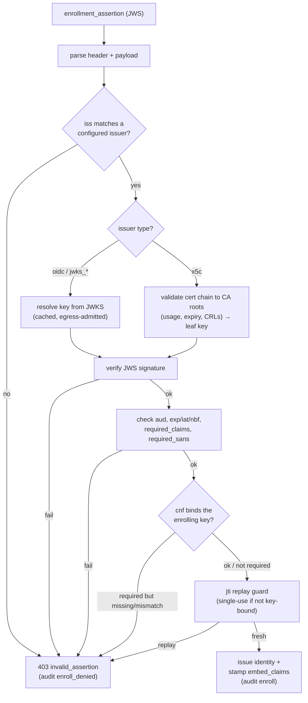

# Design: Federated & Attestation-Based Enrollment

**Status:** implemented (see [`federated-enrollment.md`](federated-enrollment.md)
for the operator how-to and per-environment recipes).
**Problem:** apd's original enrollment gates — operator-minted single-use tokens
(`token`) or none (`open`) — require a *secret in flight* or no gate at all.
Dynamic fleets (Kubernetes pods, autoscaled workers, CI jobs, devices) need a
way for an agent, or the orchestrator that spawns it, to obtain identities
**without any per-agent secret ever existing**, gated by cryptographic evidence
apd can verify.

---

## 1. Principle: never mint a secret — present a proof

A bearer enrollment secret must be transported to the workload, and any secret
copied to where a workload runs eventually leaks — the exact failure mode AAuth
exists to eliminate. So the design rule is:

> The agent self-generates its key. **Something apd already trusts vouches for
> it** by signing a short-lived, audience-scoped assertion. apd verifies the
> assertion cryptographically. No per-agent secret exists at any point.

The trust anchor shifts from *N per-agent tokens in flight* to *a small set of
issuer keys apd is configured to trust* — a strictly smaller attack surface.

Every enrollment method in the design space reduces to three ingredients:

1. **Trust anchor** — what apd trusts: an OIDC issuer's JWKS, a static JWKS, a
   CA root bundle, or a key thumbprint allow-list.
2. **Proof-of-possession (PoP) binding** — does the evidence bind the agent's
   self-generated durable key (strong), or merely prove "a legitimate workload
   is present" (weaker, often sufficient)?
3. **Freshness / replay defense** — short expiry, `aud` scoped to apd,
   single-use `jti`.

## 2. The unification: all federated evidence is a JWS

Rather than one verifier per credential type, every form of evidence is carried
as a **JWS/JWT** (`enrollment_assertion` in the `/enroll` body). Only the **key
resolution** differs, selected per configured *trusted issuer*:

| Issuer `type` | Where the verification key comes from | Covers |
|---|---|---|
| `oidc` | OIDC discovery: `{issuer}/.well-known/openid-configuration` → `jwks_uri` → JWKS (cached, egress-admitted) | Kubernetes projected ServiceAccount tokens (EKS/GKE/AKS public issuers), cloud workload identity, CI OIDC (GitHub Actions, GitLab), SPIRE OIDC discovery provider |
| `jwks_uri` | a directly configured JWKS URL (no discovery step) | static hosting, custom issuers |
| `jwks_file` / `jwks` | a JWKS loaded from disk / inlined in config | air-gapped and on-prem clusters (`kubectl get --raw /openid/v1/jwks`), operator public keys mounted via ConfigMap, SPIFFE JWT-SVID bundles |
| `x5c` | the JWS header's `x5c` certificate chain, validated to a configured **CA bundle** (optional CRLs), signature verified with the leaf key | corporate PKI (step-ca, AD CS, Vault PKI), SPIFFE X.509-style deployments, hardware/vendor attestation chains |

This means Kubernetes, cloud IdPs, CI providers, custom operators, SPIFFE, and
corporate CAs are all **the same code path** with different key resolution — and
the assertion validation (aud, exp, claims, binding, replay) is uniform.

The verification pipeline, fail-cheap and mutating no state until every check
passes — the diamonds are the only per-issuer-type divergence:

### Assertion requirements (uniform)

- `iss` — routes to the configured trusted-issuer entry (exact match).
- `aud` — MUST contain the issuer entry's `audience` (default: apd's own
  `issuer` URL). String or array accepted (Kubernetes uses arrays).
- `exp` — required, in the future; `iat`/`nbf` — not in the future (60 s skew).
- `jti` — when present and `single_use_jti` applies, consumed atomically
  (storage `put_if_absent`, TTL = remaining assertion lifetime).
- **Signature algorithms:** `EdDSA`, `RS256`, `RS384`, `RS512`, `ES256`,
  `ES384`. RSA and ECDSA verification use `ring` (already in the dependency
  tree via rustls) — no new cryptography dependencies.

### PoP binding (`cnf`)

An assertion MAY bind the agent's durable key via RFC 7800-style confirmation:
`cnf.jwk` (full JWK) or `cnf.jkt` (RFC 7638 thumbprint). When the issuer entry
sets `require_cnf_binding: true`, apd rejects assertions whose `cnf` does not
match the key that signed the enrollment HTTP request.

- **Operator-signed assertions** SHOULD bind (`require_cnf_binding: true`):
  the orchestrator knows the pod's key (or receives it) and mints a per-agent,
  key-bound assertion. A stolen assertion is then useless with any other key.
- **Platform tokens** (Kubernetes SA tokens, CI OIDC) *cannot* embed `cnf` —
  the platform mints them, not you. Their protection is: short-lived +
  `aud`-scoped to apd + (default) **single-use `jti`** + presented over a
  request signed by the enrolling key. Default policy: `single_use_jti` is
  **on when the assertion has no `cnf` binding** (limits an exfiltrated token
  to first-use, and makes theft detectable), **off when `cnf`-bound** (replay
  is harmless — it names one key — and idempotent re-enrollment stays smooth).

### Claim policy & propagation

Each trusted issuer configures:

- `required_claims` — map of claim path → matcher. Matchers: exact string,
  array-of-allowed, or prefix pattern with a trailing `*`
  (e.g. `"sub": "system:serviceaccount:agents:*"`). Claim paths resolve
  dotted keys robustly (`kubernetes.io.namespace` finds the `kubernetes.io`
  top-level key first, then descends).
- `embed_claims` — map of assertion-claim path → agent-token claim name.
  Matched values are **persisted on the enrollment record** and stamped into
  every agent token apd issues for that agent (the AAuth spec permits
  AP-defined claims; receivers ignore unknown ones). This is how
  `k8s_namespace`, `tenant`, `group`, `spiffe_id`, etc. become gateable at
  resources and Person Servers. Target names are validated against the
  reserved-claim set and `[a-z0-9_]`.
- `ps` (pin), `label`, per-issuer `allow_insecure_egress` (explicit opt-out of
  the private-network egress block for on-prem issuers — never implicit).

### x5c specifics (PKI family)

- Chain: JWS header `x5c` (standard base64 DER, leaf first) → path-validated
  with **rustls-webpki** to the entry's `ca_bundle_file` roots, usage
  `client_auth` (absent EKU accepted), at verification time; optional
  **CRL file** enables revocation checking.
- JWS signature verified with the **leaf certificate's** key (ES256/ES384
  fixed signatures converted to ASN.1 DER for webpki).
- `required_sans` — optional list of exact/prefix patterns matched against the
  leaf's DNS and URI SANs (minimal in-tree DER SAN extractor; this is how
  SPIFFE IDs like `spiffe://corp.example/ns/agents/*` are enforced).
- The payload still carries `iss` (must equal the entry's `issuer` string),
  `aud`, `exp`, and SHOULD carry `cnf` — the cert vouches for the *signer*;
  `cnf` binds the *agent key*. When the cert directly certifies the agent's
  Ed25519 durable key, `cnf` binding is trivially satisfiable too.

## 3. The thumbprint allow-list (no-assertion delegation)

For orchestrators that prefer API-driven pre-registration over signing
assertions: the orchestrator calls apd's admin API to register the durable-key
**thumbprint** it just provisioned (`POST /admin/allowed-keys`), optionally with
`ps`, `label`, and a TTL. The agent then enrolls with only its key; apd accepts
if the thumbprint is registered (consumed on success; re-enrollment of the same
key remains idempotent). No secret travels to the pod — the "credential" is the
public key's hash, registered out-of-band over the authenticated admin channel.

## 4. Method composition

`enrollment.methods` is a set: any of `"token"`, `"federated"`, `"allowlist"`,
`"open"` (legacy `enrollment.mode` still accepted). Evaluation order per
request: **assertion (if present) → enrollment token (if present) → allow-list
→ open**. A *presented but invalid* assertion or token is a hard 403 — it never
falls through to a weaker method. `federated` requires at least one trusted
issuer; `open` composes only with itself (config validation enforces sanity).

## 5. Environment → method matrix (what to deploy where)

| Environment | Method | Entry type | PoP |
|---|---|---|---|
| EKS / GKE / AKS (public OIDC issuer) | projected SA token | `oidc` | aud+jti |
| On-prem / air-gapped Kubernetes | SA token, JWKS exported to file | `jwks_file` | aud+jti |
| Custom operator (strongest) | operator-minted, `cnf`-bound assertion | `jwks_file`/`jwks_uri` | **cnf** |
| Service mesh / SPIFFE | JWT-SVID (bundle) or X.509 chain + SPIFFE SAN | `jwks_file`/`oidc` or `x5c` | aud / cert |
| Corporate PKI | cert-holder-signed JWS with `x5c` | `x5c` (+ CRL) | cert (+`cnf`) |
| CI (GitHub Actions / GitLab) | CI OIDC token | `oidc` | aud+jti |
| Cloud VMs | instance-identity JWT (GCP) via `oidc`; others via operator assertion | `oidc`/`jwks_*` | varies |
| Small known fleet, scripted | thumbprint allow-list | — | key itself |
| Humans / invitations | enrollment token (existing) | — | possession |

## 6. Security model

- **Issuer allow-list is the access boundary.** apd trusts exactly the
  configured issuers, audiences, claim constraints, and (for x5c) roots/SANs.
  Everything else is rejected before any state changes.
- **Order of checks:** parse → route by `iss` → verify signature against the
  resolved key → validate `aud`/`exp`/`iat`/`nbf` → required claims → `cnf`
  binding → `jti` replay guard → only then touch enrollment state.
- **Compromise blast radius:** an issuer signing key compromise = ability to
  enroll agents *under that issuer's constraints* (claims still apply). Keep
  operator keys in KMS/HSM; rotate; scope `required_claims` tightly. A CA
  compromise is bounded by `required_sans`.
- **Replay:** `aud` scoping prevents cross-service reuse; `exp` bounds the
  window; `jti` single-use bounds it to first-use for non-`cnf` evidence;
  `cnf` binding eliminates the threat for operator assertions.
- **SSRF:** issuer key fetches go through the same egress admission as all
  outbound fetches (HTTPS-only, no cross-host redirects, private/loopback
  blocked) unless an entry *explicitly* sets `allow_insecure_egress` — an
  operator decision per issuer, never attacker-influenced.
- **Audit:** every enrollment decision (success and denial, with method,
  issuer, subject, matched claims) is emitted as a structured JSON audit event
  (stderr and/or file), because federated enrollment removes the human from
  the loop — the log *is* the review trail.

## 7. Alternatives considered

- **Per-credential verifiers (raw SA token API calls, cloud metadata
  signatures, CSR/EST endpoints):** more surface, more code paths, each with
  bespoke parsing. The JWS unification covers the same deployments with one
  audited pipeline; anything JWS-incompatible can be wrapped by an operator
  assertion.
- **mTLS client certs at the TLS layer:** breaks the reverse-proxy deployment
  model (apd terminates TLS at the proxy) and duplicates what `x5c`-in-JWS
  achieves in-band.
- **Accepting bare self-generated keys with TOFU reputation:** already exists
  as `open`; useful for rate-limiting-by-key but cannot express "only my
  fleet", which is the requirement here.
- **New heavyweight dependencies (`rsa`, `p256`, `x509-parser`):** avoided —
  `ring` and `rustls-webpki` are already in the tree via rustls and cover
  RS*/ES* verification and X.509 path validation; the SAN extractor is a
  ~150-line focused DER walker with tests.

## 8. Spec alignment

The AAuth Bootstrap draft explicitly leaves enrollment AP-internal and
evidence-based ("a signed-in account, an attested device, a published JWKS"),
and its *Workload* section points at SPIFFE/WIMSE/cloud-attestation as the
intended direction while remaining TBD. This design implements that direction:
platform workload identity, operator delegation, and PKI attestation as
first-class enrollment evidence, with the AAuth-native `cnf` binding providing
the proof-of-possession the draft's two-key model expects.
