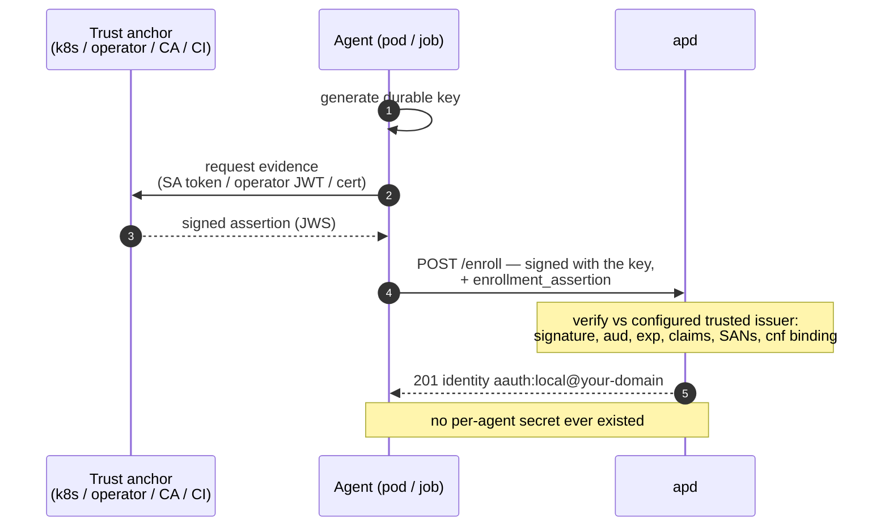

# Federated Enrollment — configuration & recipes

Federated enrollment lets agents obtain identities **without any per-agent
secret**: the agent self-generates its key, and something apd already trusts —
your Kubernetes cluster, your operator, your CI provider, your corporate CA —
vouches for it with a signed **assertion**. apd verifies the assertion and
issues the identity. This page is the operator how-to; the model and security
rationale are in [`federated-enrollment-design.md`](federated-enrollment-design.md),
and the basics of enrollment in general are in [`enrollment.md`](enrollment.md).



## 1. Enabling it

```json
"enrollment": {
  "methods": ["token", "federated", "allowlist"],
  "trusted_issuers": [ ... ]
}
```

- `methods` — the enabled gates, evaluated per request as: presented
  **assertion** → presented **enrollment token** → **allowlist** → **open**.
  A presented-but-invalid credential is a hard 403 (no fall-through).
- The legacy `"mode": "token" | "open"` form still works.
- `apd example-config --federated` prints a full starting point.

The agent's side is one extra body field on the normal enrollment request:

```http
POST /enroll                      (signed with the durable key, hwk scheme)
{ "enrollment_assertion": "<JWS/JWT>" }
```

## 2. Trusted issuer reference

Each `trusted_issuers[]` entry:

| Field | Applies to | Meaning |
|---|---|---|
| `name` | all | unique operator-chosen name (appears in audit + agent records) |
| `type` | all | `oidc` \| `jwks_uri` \| `jwks_file` \| `jwks` \| `x5c` \| `spiffe` |
| `issuer` | all | exact `iss` value assertions must carry; routes the assertion to this entry (for `spiffe`, an opaque label — routing is by `trust_domain`) |
| `trust_domain` | `spiffe` | SPIFFE trust domain (`corp.example` or `spiffe://corp.example`); a JWT-SVID whose `sub` is under it routes here |
| `audience` | all | required `aud` (string or array member). Default: apd's `issuer` URL |
| `jwks_uri` | `jwks_uri`, `oidc` (override), `spiffe` | direct JWKS URL (SPIFFE bundle for `spiffe`) |
| `jwks_file` / `jwks` | `jwks_file` / `jwks` / `spiffe` | JWKS from disk / inline (loaded at startup, fail-fast) |
| `ca_bundle_file` | `x5c` | PEM bundle of trusted CA roots |
| `crl_file` | `x5c` | optional CRL(s) (PEM or DER) — enables revocation checking |
| `required_sans` | `x5c` | leaf-cert DNS/URI SAN patterns (exact or trailing-`*`), any-of |
| `required_claims` | all | claim-path → matcher (exact, array-of-allowed, or trailing-`*` prefix). For `spiffe`, constrain the workload path via `sub` |
| `embed_claims` | all | assertion-claim path → agent-token claim name; stamped into **every token** issued for the enrollment (and inherited by its sub-agents) |
| `require_cnf_binding` | all | assertion must bind the enrolling key via `cnf.jwk`/`cnf.jkt` |
| `single_use_jti` | all | enforce single-use `jti`. Default: **true when not cnf-bound**, false when bound |
| `assurance` | all | override the assurance tier stamped into tokens (default: `x5c`/`spiffe` → `high`, else `medium`). Lowercase `[a-z0-9_]`, ≤32 chars |
| `ps` | all | pin the Person Server for these enrollments |
| `label` | all | label recorded on the enrollment |
| `allow_insecure_egress` | `oidc`, `jwks_uri`, `spiffe` | allow http / private-network fetches for THIS issuer (on-prem). Explicit opt-out of SSRF hardening |

**Assertion requirements** (uniform): `iss` matching an entry (or, for a SPIFFE
JWT-SVID, a `sub` under a trusted `trust_domain`); `aud` containing the entry's
audience; `exp` in the future (`iat`/`nbf` sane, 60 s skew); signed with
**EdDSA, RS256, RS384, RS512, ES256, or ES384**. Claim paths handle dotted key
names (`kubernetes.io.namespace` resolves the `kubernetes.io` claim).

**Key freshness:** remote JWKS (oidc/jwks_uri) are cached with a once-per-minute
per-issuer refresh floor and a 24 h ceiling, refreshed on unknown `kid`.

## 3. Recipes

### 3.1 EKS / GKE / AKS — Kubernetes projected ServiceAccount tokens

Managed clusters expose a **public OIDC issuer**, so apd verifies pod identity
tokens with zero secrets anywhere.

Pod spec — project a token with apd as the audience:

```yaml
volumes:
  - name: apd-token
    projected:
      sources:
        - serviceAccountToken:
            path: token
            audience: https://ap.example.com
            expirationSeconds: 600
```

apd config:

```json
{
  "name": "prod-eks",
  "type": "oidc",
  "issuer": "https://oidc.eks.eu-west-1.amazonaws.com/id/EXAMPLE",
  "required_claims": { "sub": "system:serviceaccount:agents:*" },
  "embed_claims": { "kubernetes.io.namespace": "k8s_namespace" },
  "label": "eks-prod"
}
```

Agent startup: read `/var/run/.../token`, generate a key, `POST /enroll` with
the token as `enrollment_assertion`. Notes: the issuer URL is `kubectl get
--raw /.well-known/openid-configuration | jq -r .issuer` (GKE/AKS analogous);
`sub` for a ServiceAccount is `system:serviceaccount:<ns>:<sa>`; SA tokens have
no `cnf`, so single-use `jti` applies by default — a stolen token is dead after
first use and theft becomes visible as a failed legitimate enrollment.

### 3.2 On-prem / air-gapped Kubernetes — `jwks_file`

When the API server's issuer isn't reachable from apd (private CA, no route),
export the cluster's JWKS and mount it:

```sh
kubectl get --raw /openid/v1/jwks > /etc/apd/k8s-jwks.json
```

```json
{
  "name": "onprem-k8s",
  "type": "jwks_file",
  "issuer": "https://kubernetes.default.svc.cluster.local",
  "jwks_file": "/etc/apd/k8s-jwks.json",
  "required_claims": { "sub": "system:serviceaccount:agents:*" }
}
```

Re-export on API-server key rotation (mount via ConfigMap and restart, or a
small sync job). Alternative if apd can reach the API server but it uses http
or a private address: `type: oidc` + `allow_insecure_egress: true`.

### 3.3 Custom operator / orchestrator — cnf-bound assertions (strongest)

Your operator (k8s operator, Nomad driver, fleet manager) holds a signing key
and mints a **per-agent, key-bound** assertion at spawn time. This is the
strongest option: a stolen assertion is useless with any other key.

Operator (pseudocode):

```text
on_spawn(agent):
  agent generates durable key; sends thumbprint (jkt) to operator over IPC
  assertion = JWS sign with OPERATOR_KEY {
    iss: "https://operator.internal", aud: "https://ap.example.com",
    sub: agent.pod_name, tenant: agent.tenant,
    cnf: { jkt: agent.jkt },          # binds the agent's key
    iat: now, exp: now+300, jti: random
  }
  hand assertion to agent → agent enrolls with it
```

apd config (mount the operator's **public** JWKS via ConfigMap/secret):

```json
{
  "name": "agent-operator",
  "type": "jwks_file",
  "issuer": "https://operator.internal",
  "jwks_file": "/etc/apd/operator-jwks.json",
  "require_cnf_binding": true,
  "embed_claims": { "tenant": "tenant" },
  "ps": "https://ps.example"
}
```

The operator's key belongs in KMS/HSM; rotate by publishing both kids during
the overlap. If the operator hosts its JWKS over https, use `jwks_uri` instead
of a file.

### 3.4 SPIFFE / SPIRE (workload identity)

Headless agents enroll with a **SPIFFE SVID** — no human gesture, no shared
secret. The trust anchor is the SPIRE trust bundle.

**JWT-SVIDs** — use the dedicated `spiffe` issuer type. A JWT-SVID has no `iss`
(SPIFFE doesn't define one) and its identity is the `sub` (`spiffe://…`), so apd
routes it by **trust domain** rather than issuer. The agent fetches a JWT-SVID
with `aud` = apd's issuer URL from the Workload API and presents it as the
enrollment assertion.

```json
{
  "name": "corp-spire",
  "type": "spiffe",
  "issuer": "corp-spire",
  "trust_domain": "corp.example",
  "jwks_file": "/etc/apd/spire-bundle.json",
  "required_claims": { "sub": "spiffe://corp.example/ns/agents/*" }
}
```

- `trust_domain` — bare (`corp.example`) or `spiffe://corp.example`. The SVID's
  `sub` must be under it.
- Bundle source — exactly one of `jwks` (inline), `jwks_file`, or `jwks_uri`.
  For **auto-rotating** SPIRE bundles prefer `jwks_uri` (re-fetched on unknown
  `kid`); `jwks_file` is loaded once at startup and needs a restart to pick up a
  rotation. If you run the SPIRE **OIDC discovery provider**, a plain `type:
  oidc` issuer also works (it supplies an `iss`).
- Constrain the workload with `required_claims` on `sub` (wildcards allowed).
- Assurance: `spiffe` enrollments issue tokens with `assurance: "high"`.

> JWT-SVIDs may omit `jti`, so single-use replay guarding can't apply — rely on
> a short SVID TTL and the `aud` binding to apd. A captured SVID lets an
> attacker enroll *their own* key under the same identity until it expires;
> keep SVID lifetimes short.

**X.509-SVIDs** — use the `x5c` recipe below with the SPIRE trust-bundle CA and
`required_sans: ["spiffe://corp.example/ns/agents/*"]`; the SPIFFE ID lives in
the certificate's URI SAN, which apd extracts and matches. (apd distinguishes
the two automatically: an assertion with an x5c chain is treated as an
X.509-SVID and routed by `iss`; one without is a JWT-SVID routed by trust
domain.)

### 3.5 Corporate PKI (step-ca, AD CS, Vault PKI) — `x5c`

Any workload holding a client certificate from your CA can enroll by signing a
short JWS with its certificate key and attaching the chain in the JOSE `x5c`
header:

Assertion (built by the workload):

```json
// header
{ "alg": "ES256", "x5c": ["<leaf DER b64>", "<intermediate DER b64>"] }
// payload
{ "iss": "https://ca.corp.example",        // must equal the entry's issuer
  "aud": "https://ap.example.com",
  "cnf": { "jkt": "<thumbprint of the agent's durable key>" },
  "iat": ..., "exp": "<= +5 min" }
```

apd config:

```json
{
  "name": "corp-ca",
  "type": "x5c",
  "issuer": "https://ca.corp.example",
  "ca_bundle_file": "/etc/apd/corp-roots.pem",
  "crl_file": "/etc/apd/corp.crl",
  "required_sans": ["spiffe://corp.example/ns/agents/*", "*.agents.corp.example"],
  "require_cnf_binding": true
}
```

apd validates the chain to your roots (client-auth usage, expiry, optional
CRLs), verifies the JWS with the **leaf** key (RSA/ECDSA/Ed25519 leaves all
work), enforces the SAN policy, and binds the agent key via `cnf`. When the CA
directly certifies the agent's Ed25519 durable key, the same key signs both the
assertion and the enrollment — the tightest possible chain.

### 3.6 CI-spawned agents — GitHub Actions / GitLab OIDC

```json
{
  "name": "github-actions",
  "type": "oidc",
  "issuer": "https://token.actions.githubusercontent.com",
  "audience": "https://ap.example.com",
  "required_claims": {
    "repository": "your-org/agents",
    "ref": "refs/heads/main"
  },
  "embed_claims": { "repository": "ci_repository" },
  "label": "ci"
}
```

Workflow side: request the ID token with `audience: https://ap.example.com`
(`permissions: id-token: write`), generate a key, enroll with the token as the
assertion. GitLab: `issuer` = your GitLab URL, claims like `project_path`.

### 3.7 Thumbprint allow-list — API-driven pre-registration

For orchestrators that prefer calling an API over signing assertions:

```sh
# orchestrator, after provisioning the agent's key:
curl -X POST https://ap.example.com/admin/allowed-keys \
  -H "Authorization: Bearer $APD_ADMIN_TOKEN" \
  -d '{"jkt": "<durable-key thumbprint>", "ps": "https://ps.example",
       "label": "batch-42", "ttl": 600}'
# the agent then enrolls with only its key — no secret ever travels to it
```

Enable with `"methods": [..., "allowlist"]`. Registrations are consumed on
first use (re-enrollment of the same key stays idempotent); `GET
/admin/allowed-keys` lists pending ones, `DELETE /admin/allowed-keys/{jkt}`
withdraws. The "credential" is the public key's hash, registered over the
authenticated admin channel.

## 4. Claims in issued tokens (`embed_claims`)

Matched assertion claims are persisted on the enrollment and stamped into
**every agent token** apd issues for that agent (sub-agents inherit them). This
is how `k8s_namespace`, `tenant`, `ci_repository`, `group` become gateable at
your MCP servers, gateways, and Person Servers — they're AP-attested claims,
and AAuth receivers ignore claims they don't recognize. Target names must be
lowercase `[a-z0-9_]` and non-reserved (validated at startup).

## 5. Audit

Every enrollment decision is emitted as a structured JSON line (stderr, plus
`audit_log_file` if set): `enroll` (method, issuer, subject, jkt, ps),
`enroll_denied` (reason), `agent_token_issued`, `allowed_key_added/removed`,
`agent_revoked`, … With no human in the issuance loop, this stream is your
review trail — ship it to your log pipeline.

## 6. Security checklist

- [ ] Scope `required_claims` tightly (namespace/SA/repo — never trust a bare issuer).
- [ ] Prefer `require_cnf_binding: true` wherever you control the assertion minting.
- [ ] Leave `single_use_jti` defaults alone unless you have a reason.
- [ ] `audience` should be apd's exact issuer URL (the default).
- [ ] Operator/CA keys in KMS/HSM; rotate with kid overlap.
- [ ] `allow_insecure_egress` only for on-prem issuers you operate, per-issuer.
- [ ] x5c: keep the CA bundle minimal (your issuing CA, not a public root store);
      use `required_sans`; wire `crl_file` if you revoke certs.
- [ ] Ship the audit log.

## 7. Troubleshooting

| Symptom (403 `invalid_assertion` detail) | Likely cause |
|---|---|
| `issuer '…' is not trusted` | assertion `iss` ≠ any entry's `issuer` (exact match, incl. scheme + no trailing slash) |
| `aud does not include …` | projected token minted without `audience:` apd's URL |
| `signature verification failed` | wrong JWKS (rotated keys? re-export `jwks_file`), or kid mismatch |
| `fetch floor active` | JWKS refetch rate-limited (once/min) — retry shortly |
| `claim '…' does not satisfy policy` | `required_claims` matcher vs actual value (check wildcard) |
| `cnf.jkt does not match` | assertion bound to a different key than the one signing the enroll |
| `assertion has already been used` | single-use `jti` replay (or a retry after a *successful* enroll from a different key) |
| `certificate chain validation failed` | leaf not chained to `ca_bundle_file`, expired, or revoked |
| `SANs do not satisfy required_sans` | leaf SAN vs pattern (URIs must match scheme too) |
| OIDC discovery fails to a private IP | expected SSRF block — use `jwks_file` or per-issuer `allow_insecure_egress` |
