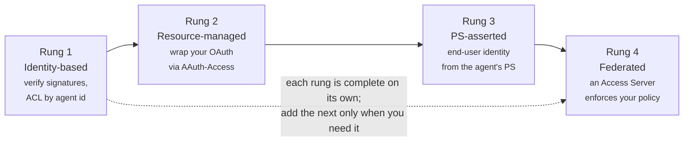
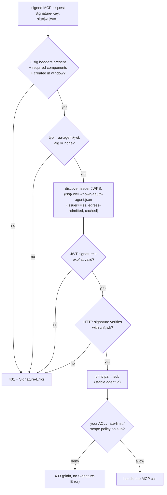

# Guide: adding AAuth auth to an MCP server (or any HTTP API)

This is a practical, implement-this-in-order guide for putting AAuth in front of
an **MCP server** or any HTTP API, so AAuth-identified agents can authenticate
and (optionally) carry a real user identity — without OAuth Dynamic Client
Registration, bearer tokens, or per-server accounts. It complements the deeper
[`research/05-connecting-resources-mcp.md`](../research/05-connecting-resources-mcp.md).

> **Why bother.** MCP's OAuth path gives each agent a different `client_id` per
> server, bearer tokens (stealable), and no portable identity. AAuth fixes
> exactly that: the agent has one self-sovereign identity (`aauth:local@domain`)
> it proves by signing each request; you verify against the Agent Provider's
> published keys. No pre-registration, no shared secrets, per-request proof of
> possession.

## 0. Decide how far up the ladder you need to go

Each rung is complete and useful on its own. Most MCP servers start at rung 1.

| Rung | What you get | You need |
|---|---|---|
| **1. Identity-based** | replace API keys: verify *which agent* is calling; ACL/rate-limit by agent id | signature verification only |
| **2. Resource-managed (two-party)** | keep your existing OAuth/login; wrap your existing token, bound to the agent's key | rung 1 + an `AAuth-Access` wrapper |
| **3. PS-asserted (three-party)** | real end-user identity (`sub`, `email`, `tenant`, `groups`, `roles`) from the agent's Person Server; you apply policy | rung 1 + issue resource tokens + verify auth tokens |
| **4. Federated (four-party)** | an Access Server enforces your policy and issues auth tokens | rung 3 + an AS |

Pick the lowest rung that meets your need. This guide covers rungs 1–3 (the AS in
rung 4 is a separate policy component; the resource-side wire is the same as
rung 3 with `aud` = your AS instead of the agent's PS).



## 1. The core competency: verify a signed request (rung 1)

This is the only thing you *must* build, and it's the 80% case. On a request
carrying `Signature-Key: sig=jwt;jwt="<agent token>"`:



1. **Parse** `Signature-Input`, `Signature`, `Signature-Key` (correlate by label).
2. **Check covered components** include `@method`, `@authority`, `@path`,
   `signature-key`, and that `created` is within your window (default 60 s). If a
   required component is missing → `401` + `Signature-Error: error=invalid_input;
   required_input=(...)`.
3. **Verify the agent token** (a JWT):
   - header `typ == "aa-agent+jwt"`, `alg != none`;
   - `dwk == "aauth-agent.json"`; fetch `{iss}/.well-known/aauth-agent.json`,
     **confirm the document's `issuer` equals `iss`** (host-poisoning defense),
     read `jwks_uri`, fetch the JWKS, find the key by the JWT header `kid`, verify
     the JWT signature. **Cache** the JWKS (refresh on unknown kid, ≥1/min floor,
     ≤24h). Apply **egress admission** (HTTPS only, no cross-host redirects, no
     private/loopback IPs, size/time caps) — these URLs come from the token.
   - `exp` in the future, `iat` not in the future.
4. **Verify the HTTP signature** with `cnf.jwk` from the token.
5. Your **principal is the `sub`** (e.g. `aauth:k7q3p9n2@ap.example`) — stable
   across the agent's key rotations. Key your ACLs, per-agent rate limits, and
   audit off it, exactly like an API-key id. `iss` tells you *which AP* vouches
   for it — trust APs per your policy.
6. Note `ps` (where you'd send a resource token for rung 3) and `parent_agent`
   (marks a sub-agent — attribute to the parent chain in audit).

Challenge unauthenticated callers with `401` +
`AAuth-Requirement: requirement=agent-token` (optionally alongside your legacy
`WWW-Authenticate` for non-AAuth clients). A policy denial *after* a valid
signature is a plain `403` (no `Signature-Error`).

Optional hardening for state-changing endpoints: require `content-digest` in the
covered components (advertise it in metadata, below), and/or keep a short replay
cache keyed by `(key thumbprint, created, @method, @authority, @path)`.

> `aauth-core` in this repo implements the whole verification path
> (`sig::parse_request_signature` + `tokens::validate_agent_token` +
> `jwks_cache`); reuse it or port it. It's Ed25519-only and dependency-light.

**Checklist — rung 1:** ☐ parse the three headers ☐ enforce required components +
`created` window ☐ verify agent token via issuer JWKS (with egress admission +
caching + issuer match) ☐ verify HTTP sig with `cnf.jwk` ☐ principal = `sub`.

## 2. For MCP servers specifically

MCP over Streamable HTTP is just HTTP, so AAuth is **middleware in front of your
MCP endpoint**:

- **Where it goes.** Run the rung-1 verification as a filter on the HTTP requests
  carrying MCP JSON-RPC. The verified `sub` becomes the MCP session's principal.
  Per-agent tool ACLs and rate limits key off it.
- **Discovery.** Advertise your MCP endpoint as an R3 vocabulary in your resource
  metadata so agents that know only your hostname can find it:
  ```json
  { "issuer": "https://mcp.example",
    "access_mode": "agent-token",
    "r3_vocabularies": { "urn:aauth:vocabulary:mcp": "https://mcp.example/mcp" } }
  ```
- **Scopes ↔ tools.** For coarse control, define scopes like
  `tools.read` / `tools.exec` in `scope_descriptions` and gate tool calls on the
  granted scope. For per-tool grants, R3's MCP vocabulary expresses operations as
  MCP tool names so auth tokens can carry exactly which tools are authorized
  (R3 is exploratory — treat as directional).
- **Human-in-the-loop / elicitation.** When a tool needs user consent or input,
  don't block — return `202` + `requirement=interaction` and let the agent bring
  the user in (§4), then resume.
- **Which rung.** Identity-based (rung 1) works today: verify the agent token,
  allowlist agents, done. Use rung 2 to wrap an existing OAuth-protected MCP
  server. Use rung 3 to get real end-user identity at the MCP server without
  running your own IdP.

**Checklist — MCP:** ☐ verification middleware in front of the MCP transport ☐
principal = agent `sub` ☐ advertise the MCP R3 vocabulary + `access_mode` ☐ map
tool consent to `202 interaction` ☐ choose a rung.

## 3. Publish resource metadata

`GET /.well-known/aauth-resource.json`:

```json
{
  "issuer": "https://mcp.example",
  "jwks_uri": "https://mcp.example/.well-known/jwks.json",
  "access_mode": "agent-token",
  "name": "Example MCP Server",
  "scope_descriptions": { "tools.read": "List and read tools", "tools.exec": "Invoke tools" },
  "signature_window": 60,
  "additional_signature_components": ["content-digest"],
  "authorization_endpoint": "https://mcp.example/authorize",
  "r3_vocabularies": { "urn:aauth:vocabulary:mcp": "https://mcp.example/mcp" }
}
```

- `issuer` MUST equal the origin the document is served from.
- `jwks_uri` is required only once you **issue** resource tokens / make signed
  calls / emit event tokens (rungs 3–4 and Events). A pure rung-1 verifier can
  omit it — it publishes no keys.
- `access_mode` (`agent-token` | `aauth-access-token` | `auth-token`) is
  advisory; the runtime `AAuth-Requirement` you return always wins and can differ
  per endpoint.

## 4. Rung 2 — wrap your existing auth (`AAuth-Access`)

Keep your current consent/login. When an endpoint needs it:

- Return `202` with a deferred/interaction response:
  ```http
  HTTP/1.1 202 Accepted
  Location: https://mcp.example/pending/abc123
  Retry-After: 0
  Cache-Control: no-store
  AAuth-Requirement: requirement=interaction; url="https://mcp.example/consent"; code="A1B2-C3D4"
  ```
  Interaction codes: Crockford base32, ≥40 bits, single-use, rate-limited;
  support `?code=...&callback=...` and redirect to `callback?error=...` on
  failure. Pending URLs: unguessable, same-origin, verify the agent's signature
  on every poll, `410` after a terminal response.
- On success return `200` with `AAuth-Access: <token68>` — an **opaque wrapper**
  of your internal token (an existing OAuth access token, a session, whatever),
  never usable as a bare bearer token. The agent replays it as
  `Authorization: AAuth <token68>` and **must cover `authorization` in its
  signature** — reject the request if it isn't covered. You can rotate it by
  returning a fresh `AAuth-Access` on any later response.

**Checklist — rung 2:** ☐ `202` + interaction for consent ☐ single-use codes +
same-origin pending URLs ☐ return `AAuth-Access` wrapping your token ☐ require
`authorization` to be covered on subsequent calls.

## 5. Rung 3 — accept user identity from the agent's Person Server

Now you get a real end user behind the agent, without running an IdP. You need
signing keys (and `jwks_uri` in metadata).

**a. Issue a resource token** when an endpoint needs user authorization — either
from your `authorization_endpoint` (`{"resource_token":"..."}`) or as a
challenge `401 AAuth-Requirement: requirement=auth-token; resource-token="eyJ..."`.
It's an `aa-resource+jwt` you sign:

```json
{
  "iss": "https://mcp.example", "dwk": "aauth-resource.json",
  "aud": "<the agent token's `ps` claim>",         // three-party: the agent's PS
  "jti": "…", "agent": "<agent id from its token>",
  "agent_jkt": "<RFC7638 thumbprint of the agent's current key>",
  "iat": …, "exp": "≤ 5 minutes",
  "scope": "tools.read tools.exec"
}
```

(Four-party: set `aud` to *your* Access Server instead; the flow on your side is
otherwise identical. If the agent sent an `AAuth-Mission` header, echo its
`{approver, s256}` into a `mission` claim.)

**b. Verify the auth token** the agent then presents
(`Signature-Key: sig=jwt;jwt="<auth token>"`). Two independent checks:

- *JWT trust:* `typ == "aa-auth+jwt"`; `dwk` ∈ {`aauth-person.json` (PS),
  `aauth-access.json` (AS)}; verify signature via the issuer's JWKS; `exp`/`iat`.
- *Request-context binding:* `aud` == your issuer; `agent` matches the request's
  signer; `cnf.jwk` == the key that signed the HTTP request (reject a
  structurally-incomplete `cnf`); `act` chain sane; at least one of `sub`/`scope`
  present; granted `scope` ⊆ what you asked for.

**c. Apply your own policy.** In three-party you trust the *agent's chosen PS* for
**identity claims only** — you still enforce access. Namespace users by
`(iss, sub)` (plus `tenant` if present): look up the tuple, create a user record
on a miss, match on a hit. Registration and login are the same flow — your logic
distinguishes the outcomes. The `sub` is pairwise per resource by design; don't
expect it to match another service's `sub`.

You may step up at any time (e.g. return a fresh `requirement=auth-token` with a
broader scope) even against a valid auth token.

**Checklist — rung 3:** ☐ sign resource tokens (`aud` = agent's `ps`, ≤5 min,
`agent_jkt` bound) ☐ verify auth tokens (JWT trust + context binding, scope ⊆
requested) ☐ key users by `(iss, sub[, tenant])` ☐ enforce your own policy.

## 6. Optional: emit events to agents (AAuth Events)

If your server has async outcomes (long jobs, availability changes), deliver via
the agent's AP (the agent has no public URL):

1. **Accept subscriptions:** a signed request whose `Signature-Key` JWT is an
   `aa-subscribe+jwt` issued by the agent's AP. Verify `typ`, AP JWKS via
   `{iss}/.well-known/aauth-agent.json`, `exp`, **`aud` == your URL**,
   `cnf.jwk` == the HTTP signer, non-empty `eid`. Store `{eid, iss(=AP),
   sub(=agent)}`; dedupe by `eid`. For protected channels, hand out single-use
   ticket URLs from an authenticated call and verify `sub` matches.
2. **On event fire:** mint an `aa-event+jwt` `{iss:you, dwk:"aauth-resource.json",
   aud:<agent id>, eid, iat, exp:<response deadline>}` and POST it to the AP's
   `event_endpoint` (resolve fresh from `{ap}/.well-known/aauth-agent.json`),
   presenting the event token as `Signature-Key: sig=jwt` and signing the HTTP
   request with the **same** resource key (the `dwk`-without-`cnf` pattern). Body
   = your AsyncAPI-described payload (keep sensitive data out; agents fetch
   specifics via authed calls).
3. **Handle AP responses:** `202` (+ `remaining_uses` when the sub had
   `max_uses`; `0` ⇒ clean up), `404` unknown/expired eid ⇒ drop the sub, `403`
   you're not the authorized resource, `429` uses exceeded.
4. Describe channels with AsyncAPI, advertise `urn:aauth:vocabulary:asyncapi`.

## 7. Trusting Agent Providers

Whether to honor tokens from a given AP is *your* policy decision, keyed on the
token's `iss`. Signals: the AP's metadata (name/description/logos/ToS), your
history with agents from that `iss`, and any AP-added claims (attestation, etc. —
only as trustworthy as the AP that signed them). Self-hosted APs (a fleet of one)
are first-class — same verification path; the trust call is per-`iss`. Maintain
an allow/deny policy over issuers just as you would over API-key issuers.

## 8. Common pitfalls

- **Rewriting Host or path at a proxy** breaks verification — the signature
  covers `@authority` and `@path`. Preserve them; don't strip `Signature-*`.
- **Trusting an auth token as a bearer** — always verify `cnf.jwk` binds it to
  the request's signer, and enforce your own policy on the claims.
- **Skipping the issuer-match check** on fetched metadata — that's the
  host-poisoning defense; without it an attacker can point you at their keys.
- **No egress admission** on JWKS fetches — the issuer/`jwks_uri` come from a
  token; block private IPs and cross-host redirects (SSRF).
- **Treating `sub` as global** — it's pairwise per resource; namespace by
  `(iss, sub)`.
- **Blocking on human input** — return `202 interaction` and let the agent drive
  the user in.
