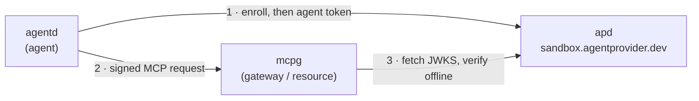

# Hosted sandbox

A public, hosted AAuth Agent Provider. Use it to build and test agents, MCP
servers, and client apps **without running a provider yourself**.

```
https://sandbox.agentprovider.dev
```

No sign-up. No account. No enrollment token. Enrollment is **open** — an agent
generates a keypair, sends one signed request, and gets an identity.

> **Development and testing only.** Tokens issued by the sandbox have **no
> production value**. There is no SLA, no data retention, and no accounts.
>
> **Data is ephemeral.** Every enrolled agent is wiped at the daily **03:00 UTC**
> reset, and on any redeploy. Treat *"agent not found"* as a normal condition and
> re-enroll. Do not build anything that depends on a sandbox identity persisting.

## At a glance

| | |
|---|---|
| Issuer / base URL | `https://sandbox.agentprovider.dev` (permanent) |
| Enrollment | Open — no credential |
| Agent identifiers | `aauth:<local>@sandbox.agentprovider.dev` |
| Agent token TTL | **300 s (5 minutes)** |
| Signature window | 60 s — your clock must be correct |
| Signing algorithm | **Ed25519** (see [below](#the-ed25519-rule)) |
| Storage | Memory only. Wiped daily at 03:00 UTC. |
| Events / `/inbox` | Disabled in this release |
| Version | `apd` 0.2.0 |

## Quickstart

Check that it is up, and see exactly what a verifier sees:

```sh
# Is it up?
curl -s https://sandbox.agentprovider.dev/healthz

# The discovery document verifiers fetch:
curl -s https://sandbox.agentprovider.dev/.well-known/aauth-agent.json

# The public keys they verify tokens against:
curl -s https://sandbox.agentprovider.dev/.well-known/jwks.json

# Every ceremony endpoint requires a signature (expect 401 + Signature-Error):
curl -si -X POST https://sandbox.agentprovider.dev/enroll | head -5
```

## Public endpoints

| Endpoint | Purpose |
|---|---|
| `GET /healthz` | Liveness. Returns the issuer and mode. |
| `GET /.well-known/aauth-agent.json` | Discovery — issuer and `jwks_uri`. |
| `GET /.well-known/jwks.json` | Provider public keys (OKP / Ed25519). |
| `POST /enroll` | Signed enrollment → an agent identifier. |
| `POST /agent-token` | Signed request → a 5-minute agent token. |

The admin API is not reachable from the internet.

## The Ed25519 rule

**This is the most common interop failure.** Read it before you debug anything
else.

The JOSE algorithm identifier is the fully-specified **`Ed25519`**, not the
polymorphic `EdDSA`. This follows RFC 9864, `draft-hardt-httpbis-signature-key-08`
§3.3, and AAuth `-10`. The sandbox rejects `EdDSA`.

It applies in three places:

```jsonc
// 1 · your JWT header
{ "alg": "Ed25519", "typ": "aa-agent+jwt", "kid": "..." }

// 2 · any JWK you send (cnf.jwk, naming JWTs)
{ "kty": "OKP", "crv": "Ed25519", "x": "...", "alg": "Ed25519" }
```

```http
# 3 · the hwk Signature-Key scheme — alg is REQUIRED here
Signature-Key: sig=hwk;kty="OKP";crv="Ed25519";x="<pub>";alg="Ed25519"
```

A wrong or missing value returns `401` with:

```http
Signature-Error: error=unsupported_algorithm
Accept-Signature-Alg: Ed25519
```

Note the separate namespace: the RFC 9421 `alg` inside `Signature-Input` is the
lowercase `ed25519`. Only the JOSE/JWK values use `Ed25519`.

## A · Developing an agent

The sandbox replaces the "run your own provider locally" step.

**1. Point your agent at the sandbox.** If you use
[agentd](https://agentd.dev) — a minimal agent runtime that already implements
the AAuth client side — this is the entire setup:

```sh
agentd --aauth-provider https://sandbox.agentprovider.dev
```

Open enrollment needs no enroll token. agentd then holds a durable Ed25519 key,
enrolls once, and refreshes its agent token before it expires. See its
[AAuth guide](https://agentd.dev/docs/aauth).

Writing your own agent instead? Steps 2 to 4 are what you implement.

**2. Enroll.** Your agent generates a durable Ed25519 keypair and sends a signed
`POST /enroll`. Sign with the `hwk` scheme, using the durable key:

```http
POST /enroll HTTP/1.1
Host: sandbox.agentprovider.dev
Signature-Input: sig=("@method" "@authority" "@path" "signature-key");created=...
Signature: sig=:<durable-key signature>:
Signature-Key: sig=hwk;kty="OKP";crv="Ed25519";x="<durable pub>";alg="Ed25519"

{}
```

You receive an identifier such as `aauth:k7q3p9n2@sandbox.agentprovider.dev`.
Re-enrolling the same key is idempotent — it returns the same identity.

**3. Get agent tokens** from `POST /agent-token`. The **5-minute TTL is
deliberate**: a normal development session exercises your refresh path
automatically. Test refresh handling here, not in production.

**4. Call a resource** with the token plus an RFC 9421 request signature. Switch
the scheme from `hwk` to `jwt`:

```http
Signature-Key: sig=jwt;jwt="<agent token>"
```

Sign with the key inside the token's `cnf.jwk`.

[`https://whoami.aauth.dev`](https://whoami.aauth.dev) is a good first target. It
is a public AAuth test resource. It fetches our discovery document and JWKS,
verifies your token, and echoes the identity back. A pass proves your agent code
is correct end to end.

**5. Expect your agent to vanish daily.** Good enrollment code retries. Treat a
missing enrollment as normal and re-enroll.

## B · Developing a resource or MCP server

The sandbox gives you a real, internet-reachable issuer to verify against.

**1. Accept tokens** whose `iss` is `https://sandbox.agentprovider.dev`.

**2. Verify them.** No pre-registration with the provider is needed — trust
bootstraps through HTTPS and discovery:

1. Fetch `{iss}/.well-known/aauth-agent.json`.
2. Confirm the document's `issuer` equals `iss`. This blocks host poisoning.
3. Follow `jwks_uri`, fetch the JWKS, and find the key by the header `kid`.
4. Verify the token signature (Ed25519), then `exp` and `iat`.
5. Verify the HTTP signature with the token's `cnf.jwk`, covering `@method`,
   `@authority`, `@path`, and `signature-key`.

Cache the JWKS. Refresh it when you see an unknown `kid`.

**3. Test manually.** Enroll a throwaway agent against the sandbox and point it
at your own resource. Because enrollment is open, this takes seconds.
[agentd](https://agentd.dev) works well as that test agent — point it at the
sandbox, then at your server.

If you would rather not write verification code at all, an MCP gateway can do it
in front of your server. [mcpg](https://mcpg.dev) resolves AAuth agent identity
on inbound requests and maps it to a gateway principal, so your server keeps its
existing handlers.

**4. Handle `alg: Ed25519`, not `EdDSA`.** See [above](#the-ed25519-rule).

Your principal is the token's `sub` claim. It is stable across the agent's key
rotations. Key your ACLs on it, exactly like an API-key id.

The full verification walkthrough is in
[Protect an MCP server](guide-mcp-server-auth.md).

## Working implementations

AAuth needs three parties. The sandbox is one of them. These projects implement
the other two, so you can assemble a complete, working path without writing the
protocol yourself:

| Project | Role | Which side of AAuth |
|---|---|---|
| [agentd](https://agentd.dev) | Agent runtime | **Client** — enrolls, holds an Ed25519 key, signs every MCP request ([AAuth guide](https://agentd.dev/docs/aauth)) |
| **apd** — this project | Agent Provider | **Issuer** — enrolls agents and mints agent tokens |
| [mcpg](https://mcpg.dev) | MCP gateway | **Resource** — verifies agent identity on inbound MCP requests |



Step 3 happens once, and then the gateway caches the key set. Verification does
not call the provider on every request.

All three are independent implementations of the same drafts. That is the point
of AAuth: no party pre-registers with any other, and trust bootstraps through
HTTPS discovery.

## Rate limits

Enforced at the edge. Exceeding a limit returns `429`.

| Path | Limit |
|---|---|
| `/enroll` | 5 requests / minute per IP |
| `/agent-token` | 30 requests / minute per IP |
| any path | 20 concurrent connections per IP; max body 64 KB |

## Troubleshooting

| Response | Cause | Fix |
|---|---|---|
| `401 error=invalid_request` | A signature header is missing. | Send all three: `Signature-Input`, `Signature`, `Signature-Key`. |
| `401 error=unsupported_algorithm` | You sent `EdDSA`, or omitted `alg`. | Use `Ed25519`. See [the rule](#the-ed25519-rule). |
| `401 error=invalid_input` | A required covered component is missing. | Read the `required_input` member and re-sign. |
| `401 error=invalid_signature` | Clock skew, or a tampered request. | Sync your clock. The window is 60 s. |
| `401 error=invalid_key` | An `hwk` without its required `alg`. | Add `alg="Ed25519"`. |
| `401 error=expired_jwt` | The token is older than 5 minutes. | Refresh and retry. |
| `403 not_enrolled` | The daily reset removed your agent. | Re-enroll. This is expected. |
| `429` | A rate limit. | Back off. See the limits above. |

## Running your own instead

The sandbox is for development. For anything real, run your own provider — it is
a single ~11 MB binary:

- [Install and deploy](deployment.md)
- [Configuration reference](configuration.md)

Your agent and resource code do not change. Only the issuer URL changes.

## Planned

Not committed, and not yet available:

- Persistent agents via GitHub sign-in, with a per-user quota
- Events and `/inbox` support
- A request inspector that shows the signature base string for debugging
- A "test my server" tool for MCP resource authors
