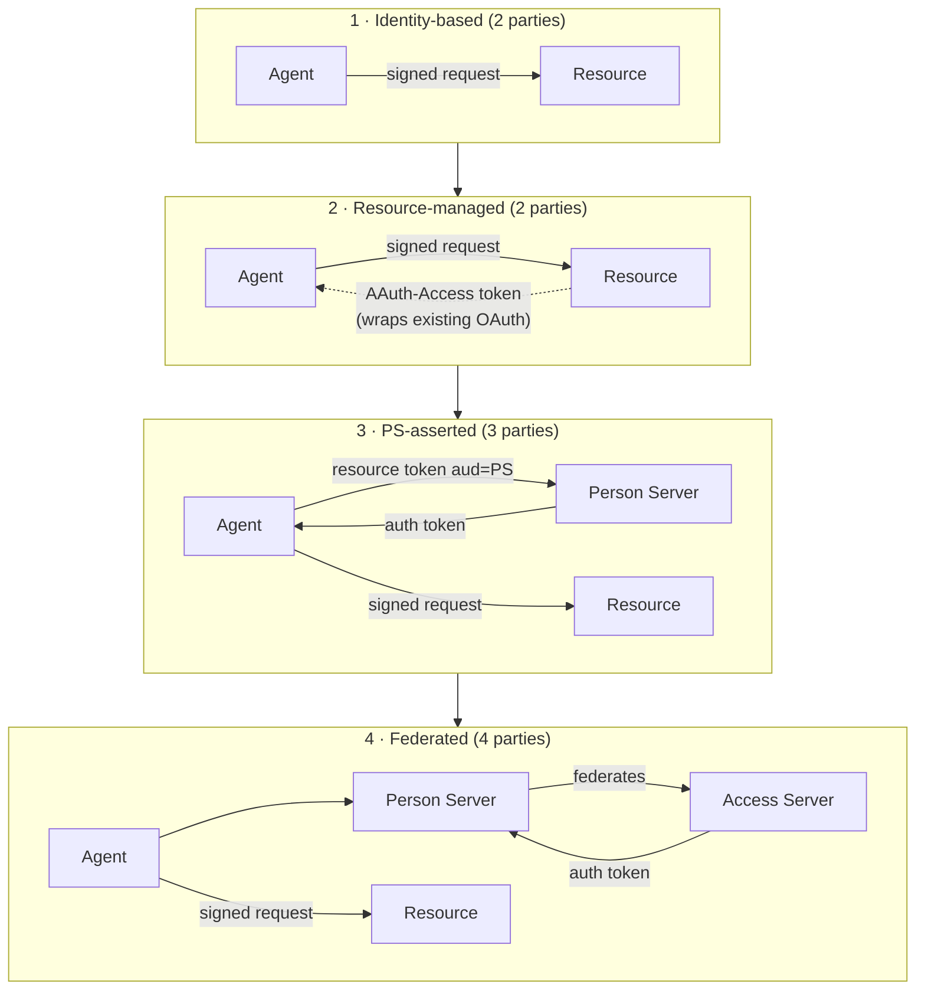

# AAuth Protocol — Engineering Overview

> Research notes distilled from `draft-hardt-oauth-aauth-protocol` (rev -09, 2026-06-17),
> source: https://github.com/dickhardt/AAuth. These notes are the shared vocabulary for
> everything else in this repo. Where behavior is normative in the spec, we say MUST/SHOULD
> with the spec's meaning.

## 1. What AAuth is

AAuth is an authorization protocol for **agents** (HTTP clients acting on behalf of a
person) talking to **resources** (APIs). Its core premise: every agent has its own
cryptographic identity — an identifier `aauth:local@domain` bound to a signing key,
published/attested by an **Agent Provider (AP)** — and every request the agent makes is
signed with HTTP Message Signatures (RFC 9421). There are no shared secrets, no bearer
tokens, no pre-registration: a resource can verify any agent's identity by fetching the
AP's published JWKS.

## 2. Parties (roles, not deployment units)

| Role | Identity | Metadata (well-known) | Job |
|---|---|---|---|
| **Person** | — | — | The accountable legal person behind the agent |
| **Agent** | `aauth:local@domain` URI | — (attested by agent token) | Signs requests, does the work |
| **Agent Provider (AP)** | HTTPS URL | `/.well-known/aauth-agent.json` | Issues agent tokens binding agent keys to identities; optional event inbox |
| **Resource** | HTTPS URL | `/.well-known/aauth-resource.json` | Protects APIs; verifies signatures; issues resource tokens |
| **Person Server (PS)** | HTTPS URL | `/.well-known/aauth-person.json` | Represents the person: consent, missions, identity claims, auth tokens |
| **Access Server (AS)** | HTTPS URL | `/.well-known/aauth-access.json` | Policy engine for a resource; issues auth tokens |

Roles can be collocated (PS+AS, Resource+Agent, AP+Resource, Agent+AP for self-hosted,
org-wide AP+PS+AS bundles). Collocation never changes the wire protocol.

## 3. Tokens (all JWTs, all proof-of-possession)

All AAuth tokens are JWTs verified by fetching the issuer's JWKS via
`{iss}/.well-known/{dwk}` where `dwk` is a claim in the token naming the well-known
metadata document (`aauth-agent.json`, `aauth-resource.json`, `aauth-person.json`,
`aauth-access.json`). `alg: none` MUST be rejected. EdDSA (Ed25519) is RECOMMENDED
everywhere.

### 3.1 Agent token — `typ: aa-agent+jwt` (issued by the AP — what *we* implement)

Header: `alg`, `typ: aa-agent+jwt`, `kid`.

Required claims:
- `iss` — AP URL (server identifier: https, host only, lowercase, no port/path/trailing slash)
- `dwk` — literally `"aauth-agent.json"`
- `sub` — agent identifier `aauth:local@domain`, **stable across key rotations**
- `jti` — unique id (replay detection / audit / revocation)
- `cnf` — RFC 7800 confirmation claim; `cnf.jwk` = the agent's public signing key
- `iat`, `exp` — lifetime **SHOULD NOT exceed 24 hours** (typical: 1 hour)

Optional claims:
- `ps` — HTTPS URL of the agent's Person Server (enables three/four-party modes)
- `parent_agent` — marks a **sub-agent**; value = parent's agent identifier

APs MAY add claims (attestation, platform posture, publisher identity…). Receivers MUST
ignore unrecognized claims.

Verification (by any receiver):
1. `typ == aa-agent+jwt`
2. `dwk == aauth-agent.json`; fetch `{iss}/.well-known/aauth-agent.json` → `jwks_uri` →
   JWKS; find key by header `kid`; verify JWT signature
3. `exp` in the future, `iat` not in the future
4. `iss` is a valid server identifier
5. `cnf.jwk` matches the key that signed the HTTP request
6. `ps` (if present) is a valid server identifier
7. `parent_agent` (if present) is a valid agent identifier → this is a sub-agent token

### 3.2 Resource token — `typ: aa-resource+jwt` (issued by resources)

Claims: `iss` (resource URL), `dwk: aauth-resource.json`, `aud` (PS URL or AS URL),
`jti`, `agent` (agent identifier), `agent_jkt` (RFC 7638 JWK thumbprint of the agent's
current key), `iat`, `exp` (SHOULD NOT exceed **5 minutes**), `scope` (space-separated).
Optional: `mission {approver, s256}`, `interaction {url, code}`.

The resource token is how a resource cryptographically asserts *what is being requested* —
it prevents confused-deputy attacks and gives the resource a voice in every (re-)authorization.

### 3.3 Auth token — `typ: aa-auth+jwt` (issued by PS or AS)

Claims: `iss` (PS or AS), `dwk` (`aauth-person.json` or `aauth-access.json`), `aud`
(resource URL), `jti`, `agent`, `cnf.jwk` (agent's key), `iat`, `exp` (**MUST NOT exceed
1 hour**; also MUST NOT outlive the agent token used to obtain it), at least one of
`sub` (directed, pairwise user id) or `scope`. Optional: `act` (delegation chain, RFC 8693
style but with `agent` instead of `sub` in each node), `mission`, `tenant`, plus OIDC claims.

### 3.4 Events tokens (from `draft-hardt-aauth-events`)

- **Subscribe token** `typ: aa-subscribe+jwt` — issued by the **AP**; see `06-events.md`.
- **Event token** `typ: aa-event+jwt` — issued by resources, delivered to the AP's
  `event_endpoint`.

## 4. Resource access modes

Four modes, incrementally adoptable; governance (missions) is orthogonal.

1. **Identity-based** (agent ↔ resource): agent signs with its agent token; resource
   decides based on who the agent is. Drop-in replacement for API keys.
   Challenge: `401` + `AAuth-Requirement: requirement=agent-token`.
2. **Resource-managed / two-party**: resource runs its own authorization (its existing
   OAuth/consent), typically via `202` + `requirement=interaction`, then returns an opaque
   token via the **`AAuth-Access`** response header. Agent replays it in
   `Authorization: AAuth <token68>` — and MUST cover `authorization` in its signature, so
   the opaque token is useless without the agent's key.
3. **PS-asserted / three-party**: resource discovers the agent's PS from the agent token's
   `ps` claim and issues a resource token with `aud = PS`. Agent sends it to the PS token
   endpoint; PS runs consent and returns an auth token asserting identity claims
   (`sub`, `email`, `tenant`, `groups`, `roles`). Resource applies its own policy;
   `(iss, sub)` namespaced per PS.
4. **Federated / four-party**: resource has its own AS; resource token has `aud = AS`.
   The PS (never the agent) calls the AS token endpoint, satisfies `requirement=claims` /
   `interaction` / `402` payment steps, verifies the resulting auth token, and hands it to
   the agent.

How the parties grow with each mode (each adds one actor; the agent's request
signature is constant throughout):

Mode selection by the resource when issuing a resource token:
`aud = AS URL` if it has an AS; else `aud = PS URL` if agent token has `ps`; else handle
authorization itself.

## 5. Protocol primitives every implementation shares

### 5.1 `AAuth-Requirement` response header (Structured Field Dictionary)

`AAuth-Requirement: requirement=<token>; param=...` on `401`, `402`, or `202`:

| requirement | status | meaning |
|---|---|---|
| `agent-token` | 401 | present your agent token (identity-based access) |
| `auth-token` | 401 | obtain an auth token; `resource-token="eyJ..."` param carries the resource token |
| `interaction` | 202 | user action needed; params `url`, `code`; poll `Location` |
| `approval` | 202 | third-party approval pending; poll `Location` |
| `clarification` | 202 | answer a question (body has `clarification`, `timeout`, `options`) |
| `claims` | 202 | (AS→PS) provide identity claims; body has `required_claims` |

Unknown requirement values ⇒ not satisfiable; agent may keep polling a `202`'s Location.
Unknown *parameters* MUST be ignored.

### 5.2 Deferred responses (`202` pattern)

Request with `Prefer: wait=N`. `202` carries `Location` (same-origin pending URL,
unguessable), `Retry-After`, `Cache-Control: no-store`, body `{"status":"pending"}` (or
`"interacting"`; unrecognized statuses = pending). Poll with GET (signed). Terminal:
`200` success, `403 denied/abandoned`, `408 expired`, `410 gone`, `429 slow_down`
(+5s linear backoff), `5xx`. Pending URLs MUST return `410` after a terminal response and
the server MUST verify the agent's identity on every poll.

### 5.3 Interaction codes

Crockford base32 alphabet (`0123456789ABCDEFGHJKMNPQRSTVWXYZ`), ≥40 bits entropy (≥8
symbols) from CSPRNG, optional presentational hyphens (stripped before compare),
case-insensitive compare with `I/L→1`, `O→0` folding, single-use, rate-limited, expire
with the pending interaction. The code is a **correlation identifier, not a credential**.

### 5.4 `AAuth-Capabilities` request header (SF List of Tokens)

`interaction`, `clarification`, `payment`. Absence ⇒ assume none. Ignore unknown values
and parameters. Not used on PS endpoints (there it's the `capabilities` body param).

### 5.5 Error format

RFC 9457 problem details, `Content-Type: application/problem+json`, with a required
`error` extension member (single code) and optional `detail`. Signature failures
additionally use the `Signature-Error` response header (see `03-http-signatures.md`).

### 5.6 Identifiers

- **Server identifier**: `https`, scheme+host only, no port/path/query/fragment/trailing
  slash, lowercase, IDN in A-label form. Exact string comparison.
- **Agent identifier**: `aauth:local@domain`; `local` ∈ `[a-z0-9._+-]`, non-empty,
  ≤255 chars; `+` reserved as the sub-agent delimiter (`parent+disc`); top-level agents
  MUST NOT contain `+`. Never parse the local part for protocol decisions — `parent_agent`
  is authoritative. Case-sensitive exact comparison.
- **Endpoint URLs**: https, no fragment, no query.

### 5.7 JWKS discovery & caching (applies to every verifier)

- Fetch `{iss}/.well-known/{dwk}` → verify document's `issuer` == URL prefix (host-poisoning
  defense) → `jwks_uri` → fetch JWKS.
- MUST cache; SHOULD respect HTTP cache headers; refresh on unknown `kid`; **MUST NOT
  fetch a given issuer's JWKS more than once per minute**; discard cache entries after
  max 24h; on same-`kid` verify failure, refresh once then `unknown_key`/`invalid_jwt`.
- **Egress admission** before any metadata/JWKS fetch: HTTPS only, size/timeout limits,
  no cross-host redirects, reject private/loopback/link-local addresses (unless configured),
  DNS-rebinding pinning.

### 5.8 Token revocation

Issuers MAY expose `revocation_endpoint`; accepts signed POST `{"jti": "..."}`; `200` if
revoked/already-invalid, `404` unknown. Only the token's issuer or a trusted PS may revoke.
For the AP, "revocation" is primarily *refusing to issue the next agent token* — all
tokens are short-lived so every re-issuance is a policy evaluation point.

## 6. Missions & governance (PS territory — context for us)

A mission is a Markdown-described, user-approved authorization context identified by
`{approver (PS URL), s256}` where `s256` = base64url(SHA-256(exact approved mission blob
bytes)). Carried by agents in the `AAuth-Mission` request header (SF Dictionary,
`approver=...; s256=...`) and echoed by mission-aware resources into resource tokens.
Resources/ASes MUST NOT dereference the blob. Missions have exactly two states: active,
terminated. The PS keeps the mission log. The AP is *not* involved in missions — but note
the covered-components rule: when `AAuth-Mission` is sent, `aauth-mission` is added to the
signature's covered components.

## 7. Delegation

- **Call chaining**: a resource acts as an agent downstream, presenting its *own* agent
  token and passing the upstream auth token as body param `upstream_token`. Routing for
  the downstream token request: `mission.approver` if present, else upstream `iss`.
  Upstream token's `aud` MUST equal the intermediary agent token's `iss`.
- **Sub-agents**: agent token with `parent_agent`; local part `parent+disc`. Single level
  deep: a PS MUST reject token requests signed by sub-agents; **an AP MUST NOT issue a
  sub-agent token whose parent is itself a sub-agent** (this is one of the two normative
  AP obligations for sub-agents). Parent-mediated authorization: the parent signs the PS
  token request and includes `subagent_token`; the issued auth token has `cnf` = sub-agent's
  key and `act.agent` = parent.

## 8. What this means for an Agent Provider implementation

Normative AP surface (small — most of AAuth lives at PS/AS/Resource):
1. Publish `/.well-known/aauth-agent.json` with `issuer` (== our URL) and `jwks_uri`
   (+ optional `name`, `description`, `logo_uri`, `callback_endpoint`, `event_endpoint`,
   `localhost_callback_allowed`, `login_endpoint`, `tos_uri`, `policy_uri`,
   `documentation_uri`).
2. Publish a JWKS; keep keys rotatable (`kid`), Ed25519.
3. Issue agent tokens meeting §3.1 (≤24h, `cnf.jwk`, stable `sub`, `jti`, optional `ps`,
   `parent_agent` with the single-level rule).
4. (Events extension) publish `event_endpoint` and act as the agent's inbox — verify
   `aa-event+jwt` deliveries and route by `eid`. See `06-events.md`.
5. Enrollment/refresh ceremonies are **non-normative** (bootstrap draft) — we define ours
   in `02-agent-provider.md`.

Non-goals for an AP: consent UI, missions, scopes, auth tokens, resource policy — those
belong to PS/AS/Resource. The AP never sees the agent's traffic to other parties
(they verify against our JWKS without calling us).
