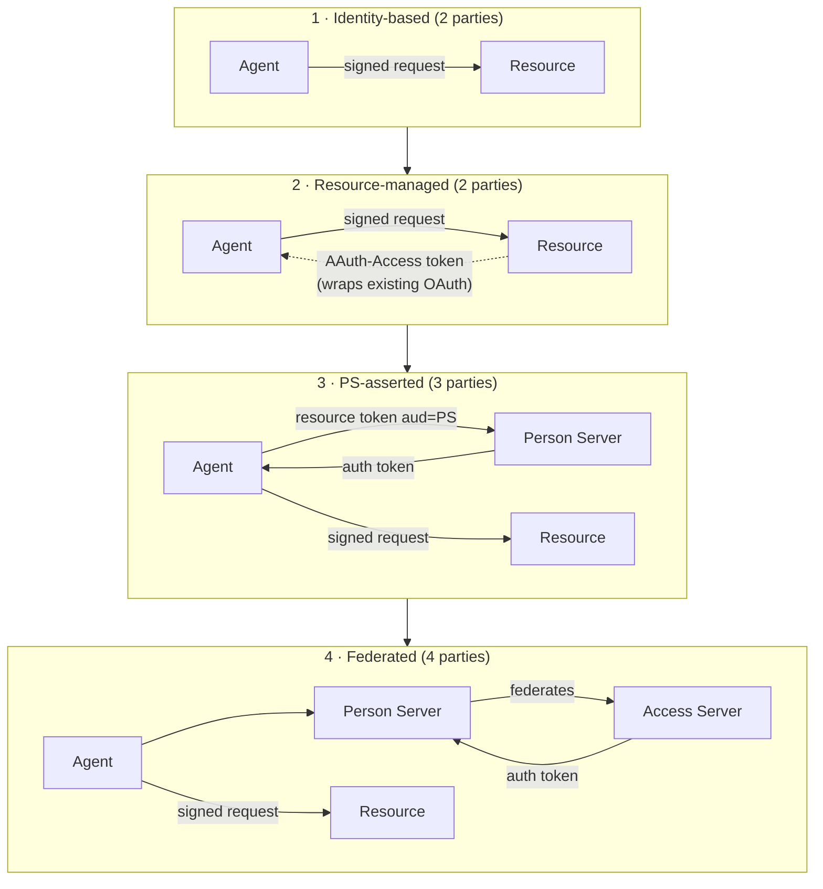

# AAuth Protocol — Engineering Overview

> Research notes distilled from `draft-hardt-oauth-aauth-protocol` (rev -09, 2026-06-17),
> source: https://github.com/dickhardt/AAuth. These notes are the shared vocabulary for
> everything else in this repo. Where behavior is normative in the spec, we say MUST/SHOULD
> with the spec's meaning.

## 1. What AAuth is

AAuth is an authorization protocol for **agents** (HTTP clients acting on behalf of a
person) talking to **resources** (APIs). Its core premise: every agent has its own
cryptographic identity — an identifier `aauth:local@domain` bound to a signing key,
published/attested by an **Agent Provider (AP)** — and every request the agent makes is
signed with HTTP Message Signatures (RFC 9421). There are no shared secrets, no bearer
tokens, no pre-registration: a resource can verify any agent's identity by fetching the
AP's published JWKS.

## 2. Parties (roles, not deployment units)

| Role | Identity | Metadata (well-known) | Job |
|---|---|---|---|
| **Person** | — | — | The accountable legal person behind the agent |
| **Agent** | `aauth:local@domain` URI | — (attested by agent token) | Signs requests, does the work |
| **Agent Provider (AP)** | HTTPS URL | `/.well-known/aauth-agent.json` | Issues agent tokens binding agent keys to identities; optional event inbox |
| **Resource** | HTTPS URL | `/.well-known/aauth-resource.json` | Protects APIs; verifies signatures; issues resource tokens |
| **Person Server (PS)** | HTTPS URL | `/.well-known/aauth-person.json` | Represents the person: consent, missions, identity claims, auth tokens |
| **Access Server (AS)** | HTTPS URL | `/.well-known/aauth-access.json` | Policy engine for a resource; issues auth tokens |

Roles can be collocated (PS+AS, Resource+Agent, AP+Resource, Agent+AP for self-hosted,
org-wide AP+PS+AS bundles). Collocation never changes the wire protocol.

## 3. Tokens (all JWTs, all proof-of-possession)

All AAuth tokens are JWTs verified by fetching the issuer's JWKS via
`{iss}/.well-known/{dwk}` where `dwk` is a claim in the token naming the well-known
metadata document (`aauth-agent.json`, `aauth-resource.json`, `aauth-person.json`,
`aauth-access.json`). Every JWK and JWT header MUST carry a **fully-specified**
`alg` — the JOSE `Ed25519` identifier (RFC 9864); `alg: none`, the polymorphic
`EdDSA`, and symmetric algorithms MUST be rejected (sig-key §3.3). `Ed25519` is
RECOMMENDED everywhere.

### 3.1 Agent token — `typ: aa-agent+jwt` (issued by the AP — what *we* implement)

Header: `alg`, `typ: aa-agent+jwt`, `kid`.

Required claims:
- `iss` — AP URL (server identifier: https, host only, lowercase, no port/path/trailing slash)
- `dwk` — literally `"aauth-agent.json"`
- `sub` — agent identifier `aauth:local@domain`, **stable across key rotations**
- `jti` — unique id (replay detection / audit / revocation)
- `cnf` — RFC 7800 confirmation claim; `cnf.jwk` = the agent's public signing key
- `iat`, `exp` — lifetime **SHOULD NOT exceed 24 hours** (typical: 1 hour)

Optional claims:
- `ps` — HTTPS URL of the agent's Person Server (enables three/four-party modes)
- `parent_agent` — marks a **sub-agent**; value = parent's agent identifier

APs MAY add claims (attestation, platform posture, publisher identity…). Receivers MUST
ignore unrecognized claims.

Verification (by any receiver):
1. `typ == aa-agent+jwt`
2. `dwk == aauth-agent.json`; fetch `{iss}/.well-known/aauth-agent.json` → `jwks_uri` →
   JWKS; find key by header `kid`; verify JWT signature
3. `exp` in the future, `iat` not in the future
4. `iss` is a valid server identifier
5. `cnf.jwk` matches the key that signed the HTTP request
6. `ps` (if present) is a valid server identifier
7. `parent_agent` (if present) is a valid agent identifier → this is a sub-agent token

### 3.2 Person token — `typ: aa-person+jwt` (issued by the PS) — **new in -11**

Claims: `iss` (PS URL), `dwk: aauth-person.json`, `aud` (resource URL), `sub` (directed
user identifier — the same value the PS uses in auth tokens), `cnf.jwk` (the agent's
key), `jti`, `iat`, `exp`. Optional: `mission_s256`, `tenant`.

Lifetime: **MUST NOT exceed 1 hour**, and MUST NOT outlive the agent token presented when
it was requested, nor the mission's `expires_at` when `mission_s256` is present.

The agent gets one from the PS's `person_token_endpoint` (REQUIRED in PS metadata) by
making a signed POST presenting **its agent token** via `Signature-Key` with `scheme=jwt`.
Parameters: `resource` (REQUIRED), `mission_s256`, `subagent_token`, `upstream_token`.
It is then presented via `Signature-Key` **in place of** the agent token, and a resource
MUST verify one before issuing a resource token.

Why it exists: a resource calling the authorization endpoint wants to know the *person*,
not the agent — and for many APIs knowing the person is enough, without a full resource
token flow. It carries no authorization from the PS, so a resource that serves on
identity alone effectively treats holding one as access.

**Assurance floor:** it asserts recognition and agency, and guarantees continuity of
`(iss, sub)`. A resource MUST NOT read it as evidence of identity proofing, legal
identity, or any assurance level. (Distinct from apd's own `assurance` claim, which
describes how the *agent* enrolled.)

**The AP has no part in this exchange** — it neither issues nor consumes person tokens.
`aauth-core` exposes `TYP_PERSON` so verifiers built on it can recognise the type.

### 3.3 Resource token — `typ: aa-resource+jwt` (issued by resources)

Claims: `iss` (resource URL), `dwk: aauth-resource.json`, `aud` (PS URL or AS URL),
`jti`, `ps`, `sub`, `presented_jti` (the `jti` of the person token whose verification
established `ps` and `sub`), `iat`, `exp` (SHOULD NOT exceed **5 minutes**), `scope`.
Optional: `mission_s256`, `interaction {url, code}`, `account`.

**Changed in -11:** resource tokens carry **no agent identifier** — `agent` and
`agent_jkt` are gone. The PS resolves the named person token and rejects any mismatch,
which is what makes mission stripping detectable; comparing claims alone cannot, because
concurrent missions mean several person tokens per agent and resource. A PS MUST retain a
record of every person token it issues (beyond `exp`, by at least the longest resource
token lifetime it accepts) and rejects an unretained `jti` with `unknown_person_token`.

**`account` request parameter (AAuth-10, §6.1):** when a resource may hold more than
one account for the same person, the agent MAY send an OPTIONAL `account` parameter to
the resource's authorization endpoint naming which account (a string in the resource's
own namespace) the authorization is for; the resource echoes it into the resource
token's `account` claim. This is a **resource-side** parameter — `apd`, being the Agent
Provider, neither consumes it nor issues resource tokens.

The resource token is how a resource cryptographically asserts *what is being requested* —
it prevents confused-deputy attacks and gives the resource a voice in every (re-)authorization.

### 3.4 Auth token — `typ: aa-auth+jwt` (issued by PS or AS)

Claims: `iss` (PS or AS), `dwk` (`aauth-person.json` or `aauth-access.json`), `aud`
(resource URL), `jti`, `ps`, **`sub` (now REQUIRED**, directed pairwise user id),
`cnf.jwk` (agent's key), `iat`, `exp` (**MUST NOT exceed 1 hour**; also MUST NOT outlive
the agent token used to obtain it), `scope`. Optional: `mission_s256`, `tenant`, plus
OIDC claims.

**Changed in -11:** no agent identifier, and **`act` and the delegation chain are
removed**. `sub` MUST be unique within the issuer: `(iss, sub)` is the identifier,
`tenant` is organizational context and never part of it, and a `sub` from one issuer
MUST NOT be matched against a record established under another, however the values
compare.

### 3.5 Events tokens (from `draft-hardt-aauth-events`)

- **Subscribe token** `typ: aa-subscribe+jwt` — issued by the **AP**; see `06-events.md`.
- **Event token** `typ: aa-event+jwt` — issued by resources, delivered to the AP's
  `event_endpoint`.

## 4. Resource access modes

**Five modes as of -11** (was four), incrementally adoptable, sorted by what the resource
ends up knowing and which party established it. Governance (missions) is orthogonal, and
a resource MAY apply different modes to different endpoints (named via R3 operation
access annotations). The values live in the new **AAuth Access Mode Value Registry**:
`agent-token`, `person-token`, `session-token`, `auth-token`.

1. **Agent identity** (agent ↔ resource): agent signs with its agent token; resource
   decides on who the agent is. Drop-in replacement for API keys.
   Challenge: `401` + `AAuth-Requirement: requirement=agent-token`.
2. **Resource-managed**: resource runs its own authorization (its existing OAuth/consent),
   typically via `202` + `requirement=interaction`, then returns an opaque credential —
   now named the **session token** — via the `AAuth-Access` response header. Agent replays
   it in `Authorization: AAuth <token68>` and MUST cover `authorization` in its signature,
   so the credential is useless without the agent's key. (The `access_mode` value
   `aauth-access-token` was renamed `session-token`.)
3. **Person identity** — *new in -11*: the resource challenges with
   `requirement=person-token`, the agent fetches a person token from its PS and presents
   it via `Signature-Key` in place of the agent token. The resource now knows the person
   and MAY serve on that alone — no resource token, no auth token. This is the "many APIs
   just need to know the person" case.
4. **PS authorization / three-party**: the resource issues a resource token with
   `aud = PS`; the agent sends it to the PS's `auth_token_endpoint` (renamed from
   `token_endpoint` in -11); the PS runs consent and returns an auth token asserting
   identity claims. Resource applies its own policy; `(iss, sub)` is namespaced per PS.
5. **Federated authorization / four-party**: resource has its own AS; the resource token
   has `aud = AS`. The PS (never the agent) calls the AS token endpoint, satisfies
   `requirement=claims` / `interaction` / `402` payment steps, verifies the resulting auth
   token, and hands it to the agent.

**Where the PS comes from (corrected in -11).** The agent token's `ps` claim is the
*advance signal* that the agent has a person server — enough for a resource to decide to
challenge for a person token. It is **not** the PS of an issued authorization. That PS is
the `iss` of the person token the resource verified, which the resource copies into the
resource token's `ps`. Three places in earlier drafts said otherwise; -11 fixes them.

How the parties grow with each mode (each adds one actor; the agent's request
signature is constant throughout):

```mermaid
flowchart TD
    subgraph M1["1 · Identity-based (2 parties)"]
        A1["Agent"] -->|signed request| R1["Resource"]
    end
    subgraph M2["2 · Resource-managed (2 parties)"]
        A2["Agent"] -->|signed request| R2["Resource"]
        R2 -.->|"AAuth-Access token<br/>(wraps existing OAuth)"| A2
    end
    subgraph M3["3 · PS-asserted (3 parties)"]
        A3["Agent"] -->|resource token aud=PS| PS3["Person Server"]
        PS3 -->|auth token| A3
        A3 -->|signed request| R3["Resource"]
    end
    subgraph M4["4 · Federated (4 parties)"]
        A4["Agent"] --> PS4["Person Server"]
        PS4 -->|federates| AS4["Access Server"]
        AS4 -->|auth token| PS4
        A4 -->|signed request| R4["Resource"]
    end
    M1 --> M2 --> M3 --> M4
```

Mode selection by the resource when issuing a resource token:
`aud = AS URL` if it has an AS; else `aud = PS URL` if agent token has `ps`; else handle
authorization itself.

## 5. Protocol primitives every implementation shares

### 5.1 `AAuth-Requirement` response header (Structured Field Dictionary)

`AAuth-Requirement: requirement=<token>; param=...` on `401`, `402`, or `202`:

| requirement | status | meaning |
|---|---|---|
| `agent-token` | 401 | present your agent token (identity-based access) |
| `auth-token` | 401 | obtain an auth token; `resource-token="eyJ..."` param carries the resource token |
| `interaction` | 202 | user action needed; params `url`, `code`; poll `Location` |
| `approval` | 202 | third-party approval pending; poll `Location` |
| `clarification` | 202 | answer a question (body has `clarification`, `timeout`, `options`) |
| `claims` | 202 | (AS→PS) provide identity claims; body has `required_claims` |

Unknown requirement values ⇒ not satisfiable; agent may keep polling a `202`'s Location.
Unknown *parameters* MUST be ignored.

### 5.2 Deferred responses (`202` pattern)

Request with `Prefer: wait=N`. `202` carries `Location` (same-origin pending URL,
unguessable), `Retry-After`, `Cache-Control: no-store`, body `{"status":"pending"}` (or
`"interacting"`; unrecognized statuses = pending). Poll with GET (signed). Terminal:
`200` success, `403 denied/abandoned`, `408 expired`, `410 gone`, `429 slow_down`
(+5s linear backoff), `5xx`. Pending URLs MUST return `410` after a terminal response and
the server MUST verify the agent's identity on every poll.

### 5.3 Interaction codes

Crockford base32 alphabet (`0123456789ABCDEFGHJKMNPQRSTVWXYZ`), ≥40 bits entropy (≥8
symbols) from CSPRNG, optional presentational hyphens (stripped before compare),
case-insensitive compare with `I/L→1`, `O→0` folding, single-use, rate-limited, expire
with the pending interaction. The code is a **correlation identifier, not a credential**.

### 5.4 `AAuth-Capabilities` request header (SF List of Tokens)

`interaction`, `clarification`, `payment`. Absence ⇒ assume none. Ignore unknown values
and parameters. Not used on PS endpoints (there it's the `capabilities` body param).

### 5.5 Error format

RFC 9457 problem details, `Content-Type: application/problem+json`, with a required
`error` extension member (single code) and optional `detail`. Signature failures
additionally use the `Signature-Error` response header (see `03-http-signatures.md`).

### 5.6 Identifiers

- **Server identifier**: `https`, scheme+host only, no port/path/query/fragment/trailing
  slash, lowercase, IDN in A-label form. Exact string comparison.
- **Agent identifier**: `aauth:local@domain`; `local` ∈ `[a-z0-9._+-]`, non-empty,
  ≤255 chars; `+` reserved as the sub-agent delimiter (`parent+disc`); top-level agents
  MUST NOT contain `+`. Never parse the local part for protocol decisions — `parent_agent`
  is authoritative. Case-sensitive exact comparison.
- **Endpoint URLs**: https, no fragment, no query.

### 5.7 JWKS discovery & caching (applies to every verifier)

- Fetch `{iss}/.well-known/{dwk}` → verify document's `issuer` == URL prefix (host-poisoning
  defense) → `jwks_uri` → fetch JWKS.
- MUST cache; SHOULD respect HTTP cache headers; refresh on unknown `kid`; **MUST NOT
  fetch a given issuer's JWKS more than once per minute**; discard cache entries after
  max 24h; on same-`kid` verify failure, refresh once then `unknown_key`/`invalid_jwt`.
- **Egress admission** before any metadata/JWKS fetch: HTTPS only, size/timeout limits,
  no cross-host redirects, reject private/loopback/link-local addresses (unless configured),
  DNS-rebinding pinning.

### 5.8 Token revocation

Issuers MAY expose `revocation_endpoint`; accepts signed POST `{"jti": "..."}`; `200` if
revoked/already-invalid, `404` unknown. Only the token's issuer or a trusted PS may revoke.
For the AP, "revocation" is primarily *refusing to issue the next agent token* — all
tokens are short-lived so every re-issuance is a policy evaluation point.

## 6. Missions & governance (PS territory — context for us)

A mission is a Markdown-described, user-approved authorization context identified by
`mission_s256` = base64url(SHA-256(exact approved mission blob bytes)).

**Reworked in -11:**

- The **`AAuth-Mission` header is removed**, along with its registration. A mission now
  reaches a resource only inside a PS-issued token, so it is no longer agent-asserted.
  The covered-components rule that went with it is gone too.
- The `mission` object is replaced by the **`mission_s256`** claim in person, resource,
  and auth tokens. `approver` is dropped everywhere except the mission blob itself.
- The approval response carries the blob base64url-encoded with `s256` alongside, so the
  digest covers an unambiguous byte sequence and the agent can verify it like a JWT payload.
- The blob gained `approved_resources` and MAY carry `expires_at`; no token carrying
  `mission_s256` may outlive it. `capabilities` moved out of the blob into the approval
  response, because it describes whether the PS can reach the person — not a term of the
  mission, and it should not perturb the digest.
- Mission **update** was added: it is appended to the log and digested, but does not change
  the blob, `mission_s256`, or any token carrying it. A mission's meaning is the approved
  blob **plus** its accepted updates, and an audit MUST read both.
- Completion moved off the interaction endpoint to `POST {mission_endpoint}/{mission_s256}`
  with `action: completion`. Termination reasons (`completed`, `revoked`, `expired`,
  `superseded`, `administrative`) are an open set; `mission_expired` folded back into
  `mission_terminated` with an OPTIONAL `termination_reason`.
- A PS MUST answer identically — status, body, headers, **and timing** — whether a mission
  does not exist or the agent does not own it, so the surface is not an existence oracle.

Resources/ASes MUST NOT dereference the blob. The PS keeps the mission log.
**The AP is not involved in missions.**

## 7. Delegation

- **Call chaining**: a resource acts as an agent downstream, presenting its *own* agent
  token and passing the upstream auth token as body param `upstream_token`. Routing for
  the downstream token request: `mission.approver` if present, else upstream `iss`.
  Upstream token's `aud` MUST equal the intermediary agent token's `iss`.
- **Sub-agents**: agent token with `parent_agent`; local part `parent+disc`. Single level
  deep: a PS MUST reject token requests signed by sub-agents; **an AP MUST NOT issue a
  sub-agent token whose parent is itself a sub-agent** (this is one of the two normative
  AP obligations for sub-agents). Parent-mediated authorization: the parent signs the PS
  token request and includes `subagent_token`; the issued auth token has `cnf` = sub-agent's
  key and `act.agent` = parent.

## 8. What this means for an Agent Provider implementation

Normative AP surface (small — most of AAuth lives at PS/AS/Resource):
1. Publish `/.well-known/aauth-agent.json` with `issuer` (== our URL) and `jwks_uri`
   (+ optional `name`, `description`, `logo_uri`, `callback_endpoint`, `event_endpoint`,
   `localhost_callback_allowed`, `login_endpoint`, `tos_uri`, `policy_uri`,
   `documentation_uri`).
2. Publish a JWKS; keep keys rotatable (`kid`), Ed25519.
3. Issue agent tokens meeting §3.1 (≤24h, `cnf.jwk`, stable `sub`, `jti`, optional `ps`,
   `parent_agent` with the single-level rule).
4. (Events extension) publish `event_endpoint` and act as the agent's inbox — verify
   `aa-event+jwt` deliveries and route by `eid`. See `06-events.md`.
5. Enrollment/refresh ceremonies are **non-normative** (bootstrap draft) — we define ours
   in `02-agent-provider.md`.

Non-goals for an AP: consent UI, missions, scopes, auth tokens, resource policy — those
belong to PS/AS/Resource. The AP never sees the agent's traffic to other parties
(they verify against our JWKS without calling us).
